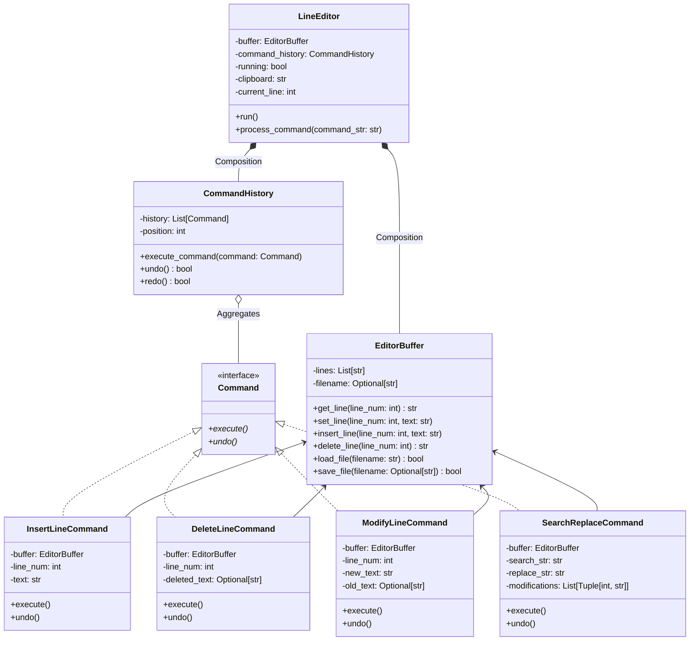

## Command Pattern

The Command Pattern is a behavioural design pattern that turns a request into a stand-alone object.
This object contains all the information about the request, including:
- What method to call
- The method’s arguments
- The object that owns the method

The main goals of the command pattern are:
- Encapsulation of requests as objects
- Decoupling between the object that invokes the operation and the one that actually performs it
- Ability to queue, log, undo, or redo operations

A typical command pattern structure includes:
- `Command` interface: defines `execute()` (and optionally `undo()`)
- `ConcreteCommand` classes: implement the interface and define a binding between a receiver and an action
- `Receiver`: the object that knows how to perform the operations
- `Invoker`: initiates requests by calling `execute()` on the command
- `Client`: creates command objects and sets their receiver

### Line Editor Code

In the Line Editor, the Command Pattern is used as follows:

| Concept            | Implementation in the Code                                                    |
|--------------------|-------------------------------------------------------------------------------|
| Command Interface  | Command abstract base class (with `execute()` and `undo()` methods)           |
| Concrete Commands  | InsertLineCommand, DeleteLineCommand, ModifyLineCommand, SearchReplaceCommand |
| Receiver           | EditorBuffer, which actually modifies the text lines                          |
| Invoker            | CommandHistory, which calls `execute()` and `undo()` on the commands          |
| Client             | LineEditor, which creates and submits commands based on user input            |

#### Flow of Operations

1. User input is parsed in `LineEditor.process_command`.

2. A `ConcreteCommand` object is created, such as `InsertLineCommand(buffer, line_num, text)`.

3. The `CommandHistory` (`command_history`) is used to execute the command with `execute_command(command)`.

4. CommandHistory:
    - Calls `execute()` on the command.
    - Stores the command in the history list for later undo/redo.

5. For undo:
    - `CommandHistory.undo()` calls `undo()` on the last executed command.

6. For redo:
    - `CommandHistory.redo()` re-calls `execute()` on the command.

Example Walkthrough (Insert Line)
- User types insert Hello World.
- LineEditor creates an InsertLineCommand.
- CommandHistory executes the command.
- InsertLineCommand.execute() calls EditorBuffer.insert_line().
- The text is inserted into the buffer.
- InsertLineCommand is stored for potential undo.

If the user calls undo, then:
- CommandHistory.undo() calls InsertLineCommand.undo().
- InsertLineCommand.undo() calls EditorBuffer.delete_line() to remove the line.

Advantages Achieved
- All modifications to the text are encapsulated in discrete command objects.
- Undo/redo operations are trivial because commands know how to undo themselves.
- Adding new actions (such as a "duplicate line" command) requires creating a new
  command class without changing other parts of the system.
- The editor remains decoupled from the details of how text is modified.

See another example of patterns used in a simple
[BASIC interpreter](./../visitor/basic.py), together with the visitor pattern.

### Summary

This implementation is a textbook application of the command pattern, where:
- Every user operation is an object.
- Execution and undo logic are localised inside each command class.
- History tracking is centralised in CommandHistory.
- The editor logic remains clean, handling only user interaction and command orchestration.

