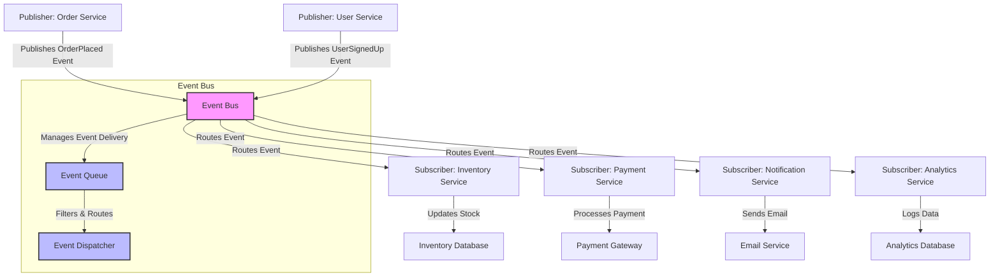

## Event Bus

The Event Bus is a powerful architectural design pattern rooted in the publish/subscribe
(pub-sub) paradigm, designed to facilitate loosely coupled, scalable, and flexible communication
between components in a software system. By decoupling the producers of information (publishers)
from the consumers (subscribers), the Event Bus enables components to interact without direct
dependencies, promoting modularity, maintainability, and extensibility. This pattern is widely
used in distributed systems, microservices, user interfaces, and real-time applications, where
components need to communicate efficiently without tight coupling.

### Core Concepts

|Concept |Description|
|--|--|
|Event |A message or signal representing something that happened.|
|Publisher |Sends or emits events.|
|Subscriber |Registers interest in certain types of events and reacts when they occur.|
|Bus |The mediator that manages event delivery to subscribers.|

1. *Event*:
   - An event is a lightweight, self-contained message or signal that represents a significant
     occurrence within the system. Events typically carry metadata such as a type (e.g., `UserLoggedIn`,
     `OrderPlaced`), a timestamp, and a payload containing relevant data (e.g., user ID, order details).
   - Events are immutable and often follow a standardized format to ensure consistency across the system.
   - Example: In an e-commerce platform, an `OrderPlaced` event might include the order ID, customer ID,
     and total amount.

2. *Publisher*:
   - Publishers are components or services that generate and emit events when something noteworthy happens.
     They do not need to know who will consume the events, which enhances decoupling.
   - Publishers send events to the Event Bus, which handles the distribution. For instance, in a game, a
     physics engine might publish a `CollisionDetected` event when two objects collide.
   - Publishers can be synchronous or asynchronous, depending on whether they wait for the event to be processed.

3. *Subscriber*:
   - Subscribers are components that register their interest in specific types of events. When an event of
     interest is published, the Event Bus notifies the relevant subscribers, which then execute their logic.
   - Subscribers can filter events based on type, properties, or other criteria. For example, a logging service
     might subscribe to all events for analytics, while a notification service might only subscribe to `UserSignedUp` events.
   - Subscribers operate independently, allowing multiple subscribers to react to the same event without coordination.

4. *Event Bus*:
   - The Event Bus acts as a central mediator that manages the routing and delivery of events from publishers
     to subscribers. It ensures that events are delivered efficiently and reliably, often supporting features
     like event filtering, prioritization, or persistence.
   - The Event Bus can be implemented in-memory (e.g., for single-process applications like GUI frameworks) or
     as a distributed system (e.g., using message brokers like RabbitMQ, Kafka, or Redis).
   - It may support advanced features such as event queuing, retry mechanisms, or guaranteed delivery for critical systems.

5. *Event Types*:
   - Events are often categorized by type to allow subscribers to select only those relevant to their functionality.
     Types can be hierarchical (e.g., `UserEvent.UserSignedUp`) or flat, depending on the system’s needs.
   - Some systems use event schemas to enforce structure and validation, ensuring that publishers and subscribers
     agree on the event format.

### Benefits

- *Loose Coupling*: Publishers and subscribers are unaware of each other, allowing components to evolve independently.
  New subscribers can be added without modifying publishers.
- *Scalability*: The Event Bus can handle high volumes of events and distribute them across multiple subscribers,
  making it suitable for large-scale systems.
- *Flexibility*: New features or components can be integrated by subscribing to existing events or publishing new
  ones, supporting dynamic and plugin-based architectures.
- *Asynchronous Communication*: Events can be processed asynchronously, improving system responsiveness, especially
  in real-time applications like games or user interfaces.
- *Fault Tolerance*: In distributed systems, the Event Bus can buffer events or retry delivery, ensuring reliability
  even if subscribers are temporarily unavailable.

### Challenges

- *Complexity*: Managing event flows, ensuring delivery guarantees, and debugging event-driven systems can be complex,
  especially in distributed environments.
- *Event Ordering*: In some cases, ensuring the correct order of events (e.g., in financial systems) requires additional
  mechanisms like sequence numbers or timestamps.
- *Event Overload*: Excessive event publishing can overwhelm the system, necessitating throttling or filtering mechanisms.
- *Debugging*: Since components are decoupled, tracing the flow of events from publisher to subscriber can be challenging
  without proper tooling or logging.
- *Consistency*: In distributed systems, eventual consistency may occur, requiring careful design to handle scenarios
  where subscribers process events at different times.

### Uses

1. *Graphical User Interfaces (GUIs)*:
   - In frameworks like JavaFX or React, the Event Bus handles user interactions such as button
     clicks, mouse movements, or keyboard inputs. For example, clicking a “Submit” button triggers
     a `ButtonClicked` event, which multiple components (e.g., form validation, UI update) can
     handle independently.
   - Example: In a web application, a `ThemeChanged` event might trigger updates to the UI, save
     user preferences, and log the action.

2. *Game Engines*:
   - Game engines like Unity or Unreal Engine rely heavily on event-driven architectures. Events
     such as `PlayerMoved`, `CollisionDetected`, or `GameOver` allow various systems (e.g., physics,
     rendering, audio) to respond appropriately.
   - Example: In a pool game, a `BallHit` event could trigger physics calculations, sound effects,
     and score updates. (E.g., collision, input events etc. in [pool game](./pool/))

3. *Microservices Architectures*:
   - In microservices, the Event Bus enables services to communicate without direct dependencies.
     For instance, an `OrderPlaced` event from an Order Service might trigger actions in Inventory,
     Payment, and Notification services.
   - Example: In a ride-sharing app, a `RideRequested` event could notify nearby drivers, update
     the user’s app, and log the request for analytics.

4. *Logging, Analytics, and Telemetry*:
   - Systems like monitoring dashboards or analytics platforms use the Event Bus to collect and
     process events for real-time insights. For example, a telemetry system might subscribe to all
     events to track system performance or user behavior.
   - Example: A website might publish `PageView` events to track user navigation for marketing analysis.

5. *IoT Systems*:
   - In Internet of Things (IoT) applications, devices publish events (e.g., `TemperatureChanged`)
     to an Event Bus, which routes them to control systems, dashboards, or alerting services.
   - Example: A smart thermostat might publish a `TemperatureThresholdExceeded` event to trigger a
     cooling system.

6. *Workflow Automation*:
   - In workflow systems, events drive state transitions. For instance, a `TaskCompleted` event
     might trigger the next step in a business process.
   - Example: In a CI/CD pipeline, a `CodePushed` event could initiate automated testing and deployment.

### Implementation Examples

- *In-Memory Event Bus*: Libraries like Guava’s EventBus or RxJava provide lightweight, in-process
  event buses for Java applications. These are ideal for single-process applications like desktop
  software or mobile apps.

- *Distributed Event Bus*: Tools like Apache Kafka, RabbitMQ, or AWS EventBridge enable event-driven
  communication in distributed systems. These support persistence, scalability, and fault tolerance
  for large-scale applications.

- *Custom Event Bus*: Some systems implement custom event buses tailored to specific needs, such as 
  real-time gaming or embedded systems, using in-memory queues or lightweight protocols.

#### Best Practices

- *Define Clear Event Schemas*: Use structured formats (e.g., JSON, Protobuf) to ensure events are predictable and validateable.
- *Use Descriptive Event Names*: Names like `UserSignedUp` or `PaymentFailed` should clearly indicate the action or state change.
- *Implement Idempotency*: Ensure subscribers can handle duplicate events gracefully, especially in distributed systems.
- *Monitor and Log Events*: Use logging or monitoring tools to track event flows for debugging and performance analysis.
- *Handle Failures*: Design the Event Bus to handle subscriber failures gracefully, using retries, dead-letter queues, or fallback mechanisms.
- *Version Events*: In evolving systems, version events to avoid breaking changes when schemas change.

#### Example Scenario: E-Commerce Platform

Imagine an e-commerce platform where a customer places an order. The Order Service publishes an `OrderPlaced` event to the Event Bus, containing the order ID, customer details, and items. The Event Bus routes this event to multiple subscribers:
- The Inventory Service reduces stock levels.
- The Payment Service processes the payment.
- The Notification Service sends a confirmation email to the customer.
- The Analytics Service logs the order for reporting.
Each subscriber operates independently, and new subscribers (e.g., a Fraud Detection Service) can be added without modifying the Order Service.

### Mermaid Diagram

Below is a Mermaid diagram illustrating the Event Bus architecture, showing publishers, subscribers, and the flow of events.

*Explanation of the Diagram*:
- *Publishers* (Order Service, User Service) send events to the Event Bus.
- The *Event Bus* manages event delivery through an internal *Event Queue* and *Event Dispatcher*.
- *Subscribers* (Inventory, Payment, Notification, Analytics Services) receive relevant events
  and perform their tasks, interacting with external systems like databases or gateways.
- Arrows represent the flow of events from publishers to the Event Bus and then to subscribers.

