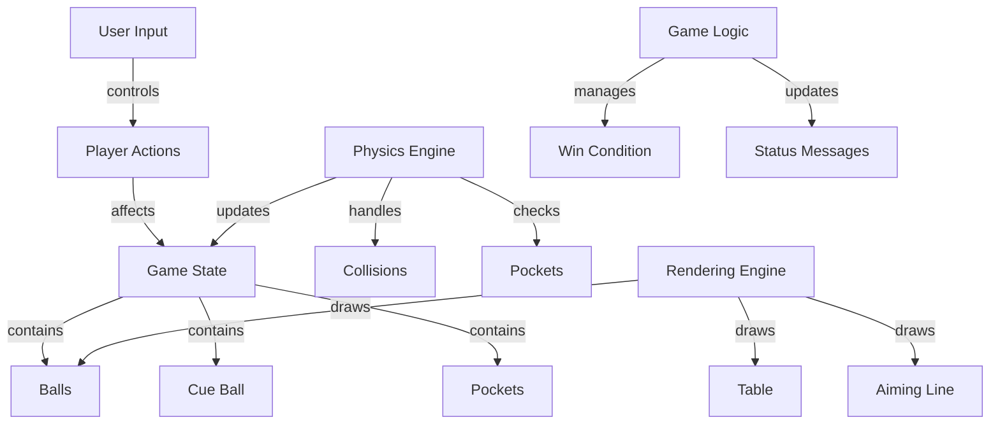
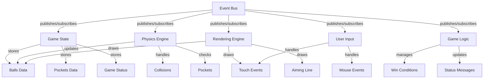

### No Event Bus

```mermaid
graph TD
    GS[Game State] -->|contains| B[Balls]
    GS -->|contains| C[Cue Ball]
    GS -->|contains| P[Pockets]
    
    UI[User Input] -->|controls| PL[Player Actions]
    PL -->|affects| GS
    
    PE[Physics Engine] -->|updates| GS
    PE -->|handles| COL[Collisions]
    PE -->|checks| POCK[Pockets]
    
    RE[Rendering Engine] -->|draws| T[Table]
    RE -->|draws| B
    RE -->|draws| AL[Aiming Line]
    
    GL[Game Logic] -->|manages| WIN[Win Condition]
    GL -->|updates| STAT[Status Messages]
```

### With Event Bus

```mermaid
graph TD
    EB[Event Bus] -->|publishes/subscribes| GS[Game State]
    EB -->|publishes/subscribes| PE[Physics Engine]
    EB -->|publishes/subscribes| RE[Rendering Engine]
    EB -->|publishes/subscribes| UI[User Input]
    EB -->|publishes/subscribes| GL[Game Logic]
    
    GS -->|stores| B[Balls Data]
    GS -->|stores| P[Pockets Data]
    GS -->|stores| S[Game Status]
    
    PE -->|updates| B
    PE -->|handles| C[Collisions]
    PE -->|checks| PO[Pockets]
    
    RE -->|draws| T[Table]
    RE -->|draws| B
    RE -->|draws| AL[Aiming Line]
    
    UI -->|handles| M[Mouse Events]
    UI -->|handles| T[Touch Events]
    
    GL -->|manages| WC[Win Conditions]
    GL -->|updates| SM[Status Messages]
```