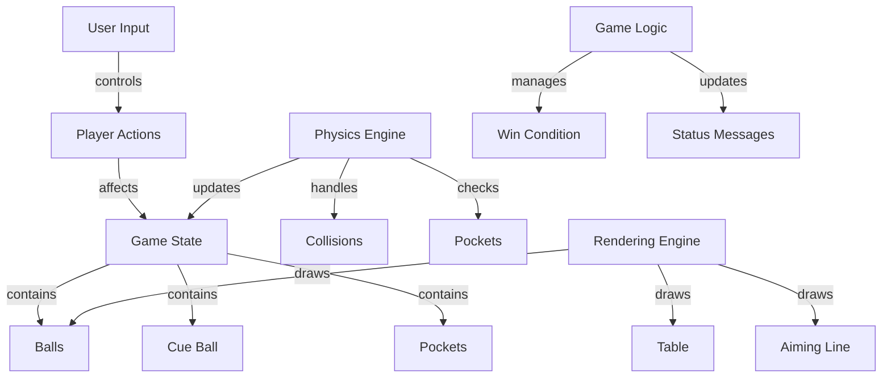
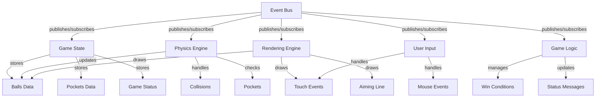

### No Event Bus (Direct)

### With Event Bus

### 1. Architectural Approach

| Event Bus Version | Direct Implementation |
|---|---|
| Decoupled components via pub/sub pattern | Tightly coupled components |
| Event-driven architecture | Imperative/procedural flow |
| Centralized event management | Direct state mutations |
| Observer pattern for communication | Direct method calls |

### 2. Component Communication

| Event Bus | Direct |
|---|---|
| Components communicate through events (`emit`/`on`) | Components directly modify shared state |
| Example: `eventBus.emit('ball:pocketed', data)` | Example: Directly modifying `balls` array |
| Loose coupling between systems | Tight coupling between input/physics/render |

### 3. Key Implementation Differences

| Aspect | Event Bus Version | Direct Version |
|---|---|---|
| Input Handling | Event-driven subscriptions | Direct canvas event callbacks |
| Physics Updates | Event-triggered calculations | Direct state mutations in loop |
| Collision Handling | Emits `ball:collision` events | Immediate collision resolution |
| Pocket Detection | Emits `ball:pocketed` events | Direct array manipulation |
| Status Updates | Event-driven messages | Direct DOM manipulation |

### 4. Advantages

| Event Bus | Direct |
|---|---|
| Easier to add new features modularly | Simpler initial implementation |
| Better separation of concerns | Less boilerplate code |
| Reusable event patterns | Direct performance access |
| Easier debugging via event logs | Faster prototyping |

### 5. Disadvantages

| Event Bus | Direct |
|---|---|
| Added complexity | Harder to maintain long-term |
| Event tracking overhead | Brittle component interactions |
| Potential event leaks | Difficult to add new features |
| Learning curve for patterns | Global state management risks |

### 6. Key Observations

1. State Management  
   - Event Bus: State changes happen through controlled event responses  
   - Direct: Global state is freely modified anywhere

2. Scalability  
   - Event Bus: New features can be added via new event types  
   - Direct: Changes risk breaking existing functionality

3. Debugging  
   - Event Bus: Traceable via event flow (e.g., `'ball:collision'` events)  
   - Direct: Requires breakpoints in linear code

4. Code Organization  
   - Event Bus: Natural separation (input, physics, render subsystems)  
   - Direct: Mixed responsibilities in game loop

5. Performance  
   - Event Bus: Slight overhead from event system (~negligible)  
   - Direct: Minimal abstraction overhead

6. Testability  
   - Event Bus: Easier to mock components via event spies  
   - Direct: Requires full game state setup for tests

### 7. When to Use Which

- Choose Event Bus for:  
  - Larger projects needing modularity  
  - Team collaborations  
  - Expected feature expansion  
  - Complex interaction patterns

- Choose Direct for:  
  - Simple single-developer projects  
  - Performance-critical micro-optimizations  
  - Quick prototypes/POCs  
  - Limited scope/short-lived projects

The event bus version represents a more mature architectural pattern,
while the direct implementation reflects a common "get it working" approach.

