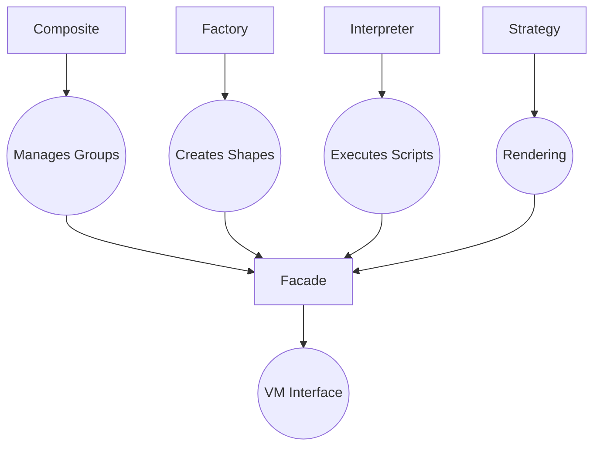

## Façade Pattern





VM structure as central interface

VM encapsulates all system components

Simplified API via `processScriptFile(`

```c
typedef struct {
    int width;
    int height;
    int*** image;
    GraphicComponent** components;
    ScriptAST* ast;
    // .. other fields
} VM;

bool processScriptFile(const char* filename, ...) {
    // coordinates parser, VM, and renderer
}
```


