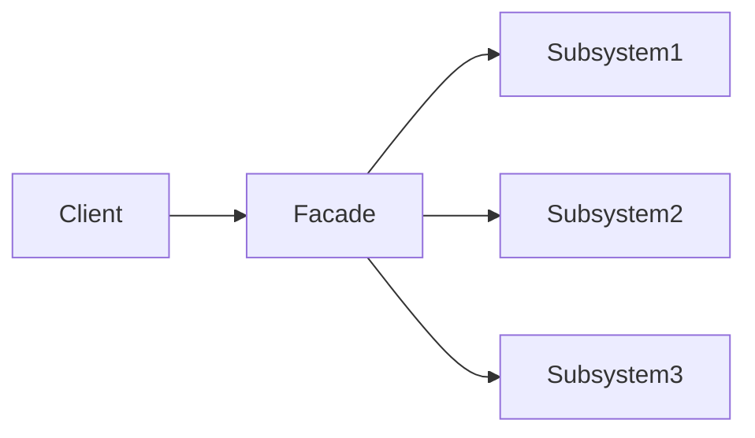
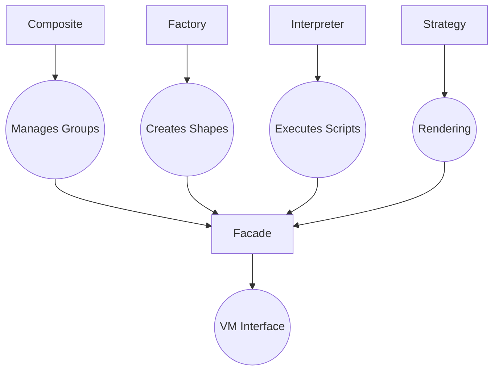

## Façade Pattern

The *Facade Pattern* is a structural design pattern that provides a *simplified interface* to a
complex system of classes, libraries, or subsystems.
- *Hide complexity*: Mask intricate implementation details
- *Unify access*: Provide a single entry point for common operations
- *Decouple*: Reduce dependencies between clients and subsystems



1. *Client*: Interacts only with the Facade
2. *Facade*: Coordinates work between subsystems
3. *Subsystems*: Independent components with specialised functionality


### Example



| Component | Role | Code |
|---|---|---|
| *Facade* | `VM` structure | `typedef struct VM { ... }` |
| *Subsystems* | - Parser<br>- Memory Manager<br>- Renderer<br>- AST | `parseScript()`, `trackedMalloc()`, `renderCircle()`, `ScriptAST` |
| *Client* | `main()` function | `processScriptFile()` calls |


#### Facade Interface

```c
// Simplified facade operations
void initVM(...);          // Initialise subsystems
void parseScript(...);     // Handle script parsing
void executeAST(...);      // Coordinate rendering
void outputImage(...);     // Manage final export
void freeVM(...);          // Cleanup all resources
```


```c
int main() {
    // Client only interacts with the facade
    processScriptFile("input.txt", 800, 600, "output.ppm");
}
```

```c
bool processScriptFile(...) {
    VM* vm = initVM(...);         // 1. Initialise subsystems
    parseScript(vm, ...);         // 2. Coordinate parsing
    executeAST(vm);               // 3. Manage execution
    outputImage(vm, ...);         // 4. Handle rendering
    freeVM(vm);                   // 5. Cleanup everything
}
```


1. *Complexity Hiding*:
   - Clients don't need to know about:
     ```c
     // Hidden from client:
     int*** image = vm->image; 
     CompositeGroup* group = vm->groupStack[...];
     ASTNode* node = vm->ast->head;
     ```

2. *Unified Workflow*:
   ```c
   // Single call handles:
   // - File I/O
   // - Memory allocation
   // - AST construction
   // - Rendering pipeline
   processScriptFile(...);
   ```

3. *Change Isolation*:
   - Subsystems can evolve independently:
     ```c
     // Old renderer:
     void renderCircle(...) { /* pixel loop */ }
     
     // New renderer (no client impact):
     void renderCircleGPU(...) { /* OpenGL calls */ }
     ```

4. *Error Handling*:
   - Centralised error recovery:
     ```c
     if (!parseScript(...)) {
         freeVM(vm);  // Automatically cleans all subsystems
         return false;
     }
     ```


### When to Use Facade

The implementation demonstrates "ideal use cases" for Facade:
- *Graphics pipelines*: Coordinating rendering steps
- *Language interpreters*: Managing parsing/execution
- *Resource-heavy systems*: Centralising memory management
