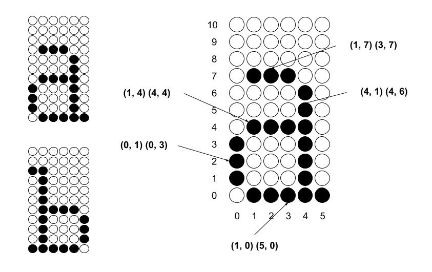

## The Mediator Pattern

The Mediator pattern represents a sophisticated approach to software design within the family of behavioural design patterns. At its core, this pattern addresses a common challenge in object-oriented systems: how to manage communication between multiple objects without creating tightly coupled dependencies. The pattern accomplishes this by introducing a central mediator object through which all components communicate, rather than allowing direct interactions between them. This fundamental shift in communication structure promotes loose coupling throughout the system, as components no longer need to reference each other explicitly. As a result, the interaction logic can be modified independently without disrupting the component implementations.

#### Core Principles

The Mediator pattern is built upon several foundational principles that guide its implementation and use. The first principle is reduced coupling, where components communicate exclusively through the mediator, eliminating the need for direct references to one another. This leads naturally to the second principle of centralised communication, as all interactions between components are channeled through and managed by a dedicated mediator class. The third principle focuses on enhanced maintainability, as changes to interaction logic remain confined to the mediator rather than being distributed across multiple components. Finally, the pattern emphasises simplified component logic, allowing individual components to focus on their specific responsibilities without being burdened by complex inter-component communication concerns.

#### Structure

The implementation of the Mediator pattern typically involves several key elements working in concert. The pattern begins with a Mediator Interface that defines how concrete mediators will communicate with components. This interface establishes the contract for interaction and provides a stable reference point for all components. The Concrete Mediator implements this interface and contains the coordination logic that governs how components interact. The Components themselves are independent objects that know only about the mediator interface, remaining entirely unaware of other components in the system. This structure creates a star-like communication topology, with the mediator at the center and components at the periphery.

#### When to Use the Mediator Pattern

The Mediator pattern shines in several specific contexts within software development. It is particularly valuable when a set of objects communicate in complex but well-defined ways, providing structure to these interactions. The pattern also proves useful when reusing components becomes difficult due to their numerous and intricate dependencies, as it can help disentangle these relationships. Developers might also turn to the Mediator pattern when they want to customise interaction behaviour without resorting to subclassing, providing a more flexible approach to behaviour modification. Finally, the pattern offers a compelling solution when dependencies between objects grow so complex that they become difficult to understand and maintain.

#### Advantages

Adopting the Mediator pattern brings several significant advantages to a software system. First and foremost, it dramatically reduces coupling between components, as they no longer need direct knowledge of one another. The pattern also centralises control logic in a single location, making it easier to understand and modify the system's behaviour. By simplifying component interactions, the Mediator pattern allows developers to reason about the system more effectively and make changes with greater confidence. All these factors contribute to code that is more maintainable and reusable, as components can be extracted and used in different contexts without bringing along unwanted dependencies.

#### Disadvantages

Despite its many benefits, the Mediator pattern is not without potential drawbacks that developers should consider. The mediator itself can evolve into a monolithic class if not designed carefully, potentially becoming a god object that knows too much and does too much. The centralised nature of the pattern might also introduce a single point of failure, where issues in the mediator can affect the entire system. Additionally, as the number of components and interactions grows, the mediator can become excessively complex, potentially making it difficult to understand and maintain. These risks underscore the importance of thoughtful design when applying the pattern.

#### Real-World Analogies

To better understand the Mediator pattern, consider some analogies from the physical world.
Air Traffic Control serves as an excellent example, where pilots communicate with the control
tower (the mediator) rather than directly with each other, creating a safer and more orderly
system. Similarly, an Event Organizer coordinates activities and communications between participants
without requiring them to interact directly with one another. These real-world examples highlight
how centralised coordination can simplify complex interactions between multiple parties.

### Text Rendering System

The text rendering system implements the Mediator pattern to coordinate the activities
of rendering text using different line drawing algorithms.

#### Components

1. *RenderingMediator*
   - Acts as the central coordination point for all other components
   - Maintains rendering settings (dimensions, scale, margins)
   - Manages image buffers for both rendering algorithms
   - Coordinates the text rendering process
   - Handles saving the rendered images to files

2. *CharacterDataProvider*
   - Encapsulates character data
   - Provides character line data when requested
   - Independent of rendering logic

3. *LineDrawer*
   - Contains line drawing algorithms
   - Draws lines to the appropriate image buffers
   - Communicates with the mediator but doesn't know about other components

4. *CharacterRenderer*
   - Responsible for rendering individual characters
   - Translates and scales character line data
   - Requests line drawing through the mediator

5. *TextRenderingFacade*
   - Provides a simplified interface to the client
   - Demonstrates combining the Mediator pattern with the Facade pattern

#### Communication Flow

1. Client interacts with the TextRenderingFacade
2. Facade delegates to the RenderingMediator
3. Mediator coordinates with:
   - CharacterDataProvider to get character data
   - CharacterRenderer to render each character
   - LineDrawer to draw the lines using both algorithms
4. Mediator handles saving the resulting images

#### Benefits

1. *Separation of Concerns*
   - Character data is separated from rendering logic
   - Line drawing algorithms are encapsulated in their own class
   - Image management is centralised in the mediator

2. *Flexibility for Extensions*
   - New rendering algorithms can be added by extending the LineDrawer
   - New character sets can be introduced by creating new CharacterDataProviders
   - Output formats can be changed without affecting other components

3. *Reduced Complexity*
   - Each component has a clear, single responsibility
   - Components don't need to know about each other
   - The rendering process is coordinated in one place

4. *Clear Visualisation Comparison*
   - The separation of rendering algorithms into distinct images allows for direct comparison

#### Potential Extensions

1. *Multiple Font Styles*
   - Implement different CharacterDataProviders for different fonts

2. *Text Effects*
   - Add effect processors that modify rendering through the mediator

3. *Color Support*
   - Extend the LineDrawer to support colored lines

4. *Output Format Variations*
   - Add support for different file formats beyond PPM

5. *Dynamic Font Scaling*
   - Implement adaptive font sizing through the mediator

6. *Extend with lower case*
   - Implement lower case but hand plotting each character in vector format.

### Conclusion

The Mediator pattern provides a robust structural foundation for the text rendering system,
enabling a clear separation of concerns while facilitating complex interactions between components.
The addition of the Facade pattern further enhances the system by simplifying client usage.
Together, these patterns demonstrate how design patterns can be effectively combined to create
systems that are not only functional but also robust and maintainable over time. Through careful
application of these principles, the text rendering system achieves both flexibility and clarity,
serving as an excellent example of the benefits that thoughtful design can bring to software
development.

