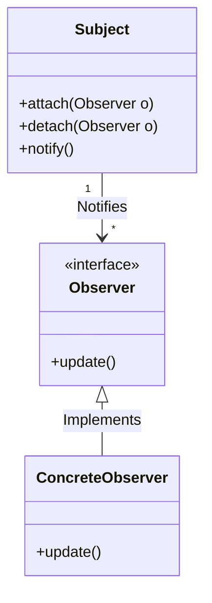

```mermaid
classDiagram

    %% Observer Pattern
    class Subject {
        +attach(Observer o)
        +detach(Observer o)
        +notify()
    }

    class Observer {
        <<interface>>
        +update()
    }

    class ConcreteObserver {
        +update()
    }

    Subject "1" --> "*" Observer : Notifies
    Observer <|-- ConcreteObserver : Implements
```
