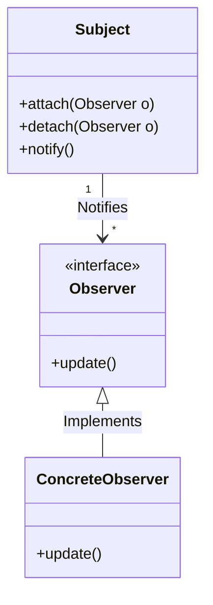
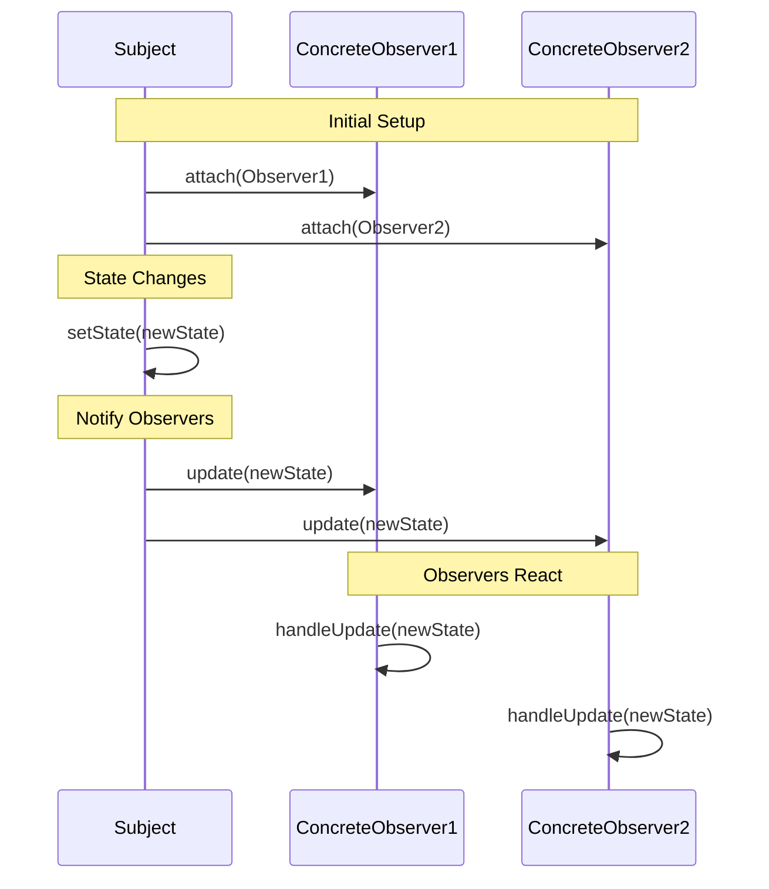

```mermaid
classDiagram

    %% Observer Pattern
    class Subject {
        +attach(Observer o)
        +detach(Observer o)
        +notify()
    }

    class Observer {
        <<interface>>
        +update()
    }

    class ConcreteObserver {
        +update()
    }

    Subject "1" --> "*" Observer : Notifies
    Observer <|-- ConcreteObserver : Implements
```

```mermaid
sequenceDiagram
    participant Subject
    participant Observer1 as ConcreteObserver1
    participant Observer2 as ConcreteObserver2

    Note over Subject,Observer2: Initial Setup
    Subject ->> Observer1: attach(Observer1)
    Subject ->> Observer2: attach(Observer2)

    Note over Subject: State Changes
    Subject ->> Subject: setState(newState)
    
    Note over Subject: Notify Observers
    Subject ->> Observer1: update(newState)
    Subject ->> Observer2: update(newState)
    
    Note over Observer1,Observer2: Observers React
    Observer1 ->> Observer1: handleUpdate(newState)
    Observer2 ->> Observer2: handleUpdate(newState)
```

