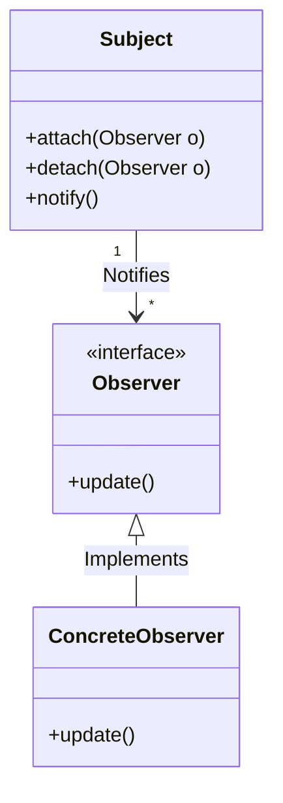
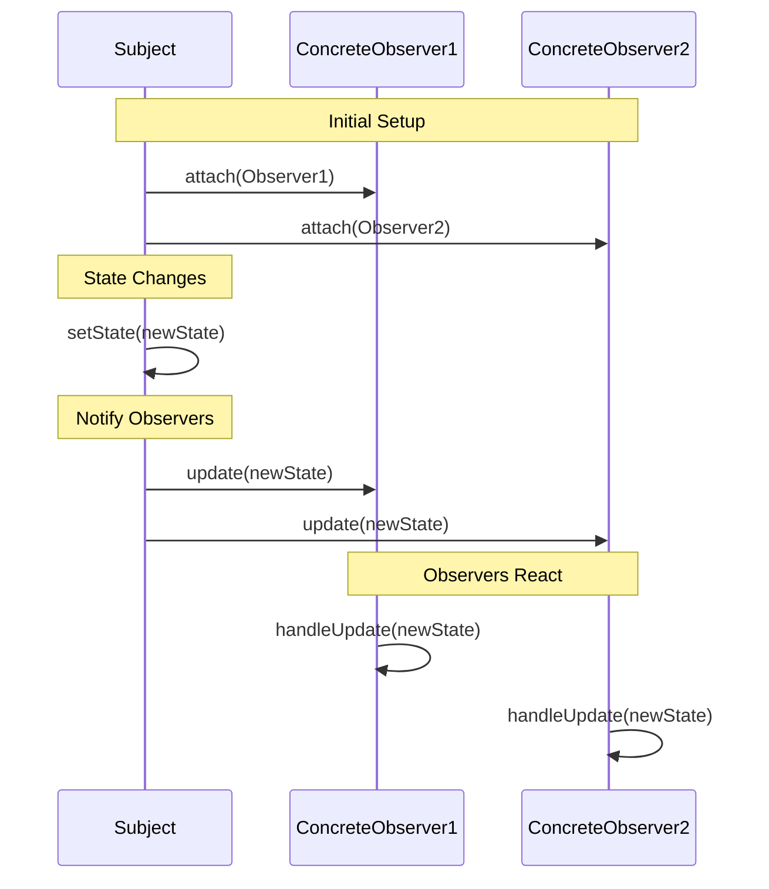

## The Observer Pattern

The Observer pattern is a behavioral design pattern that defines a one-to-many dependency
between objects so that when one object (the subject) changes its state, all its dependent
objects (observers) are notified and updated automatically. This pattern is commonly used
to implement event-handling systems, where multiple components need to react to changes
in another component.

Characteristics:
- *Subject*: Maintains a list of observers and provides methods to attach, detach, and notify them.
- *Observer*: Defines an interface (or concrete class) with an update method that is called
  when the subject's state changes.
- *Loose Coupling*: Observers and subjects are loosely coupled; the subject doesn't need to know
  the details of the observers, only that they implement the update interface.
- *Push vs. Pull*: The subject can either push specific state changes to observers or let observers
  pull the required data after being notified.







#### Use

- Event-driven systems (e.g., GUI frameworks where UI elements react to user input).
- Real-time data monitoring (e.g., stock price updates).
- Publish-subscribe systems (e.g., message queues or news feeds).


### Overall Implementation

1. *Define the Observer Interface*: Create an interface or abstract class with an `update`
   method that observers must implement.

2. *Create the Subject*: Implement a subject that maintains a list of observers, provides
   methods to add/remove observers, and notifies them of state changes.

3. *Concrete Observers*: Implement specific observers that react to state changes in the subject.

4. *State Change and Notification*: When the subject's state changes, it iterates through
   its observer list and calls their `update` method, passing relevant data if needed.

5. *Dynamic Subscription*: Observers can subscribe or unsubscribe from the subject at runtime.


#### Pros and Cons

Pros:
- Promotes loose coupling between subject and observers.
- Allows dynamic addition/removal of observers.
- Supports broadcasting to multiple objects.

Cons:
- Can lead to memory leaks if observers are not properly detached.
- Notification overhead increases with many observers.
- Observers may become dependent on the subject's state, creating implicit dependencies.


### Example

Below is a concise but complete implementation of the Observer pattern in C. The example models
a simple stock price monitoring system where a `Stock` (subject) notifies multiple `Investor`
observers when its price changes.

```c
#include <stdio.h>
#include <stdlib.h>

// Forward declarations
typedef struct Observer Observer;
typedef struct Stock Stock;

// Observer interface (function pointer for update)
typedef void (*UpdateFunc)(Observer*, float);

// Observer structure
struct Observer {
    void* data;           // Generic pointer for observer-specific data
    UpdateFunc update;    // Function pointer for update method
};

// Subject (Stock) structure
struct Stock {
    float price;          // State: stock price
    Observer* observers;  // Array of observer pointers
    int observer_count;   // Number of observers
    int max_observers;    // Capacity of observer array
};

// Concrete Observer: Investor
typedef struct {
    const char* name;     // Investor name
} Investor;

// Update function for Investor
void investor_update(Observer* observer, float price) {
    Investor* investor = (Investor*)observer->data;
    printf("%s received update: Stock price is now %.2f\n", investor->name, price);
}

// Create an observer
Observer* create_observer(void* data, UpdateFunc update) {
    Observer* observer = (Observer*)malloc(sizeof(Observer));
    observer->data = data;
    observer->update = update;
    return observer;
}

// Create a stock (subject)
Stock* create_stock(float initial_price) {
    Stock* stock = (Stock*)malloc(sizeof(Stock));
    stock->price = initial_price;
    stock->observer_count = 0;
    stock->max_observers = 10;
    stock->observers = (Observer*)malloc(stock->max_observers * sizeof(Observer*));
    return stock;
}

// Attach an observer to the stock
void attach_observer(Stock* stock, Observer* observer) {
    if (stock->observer_count < stock->max_observers) {
        stock->observers[stock->observer_count++] = observer;
    } else {
        printf("Cannot attach more observers, limit reached.\n");
    }
}

// Detach an observer from the stock
void detach_observer(Stock* stock, Observer* observer) {
    for (int i = 0; i < stock->observer_count; i++) {
        if (stock->observers[i] == observer) {
            stock->observers[i] = stock->observers[--stock->observer_count];
            break;
        }
    }
}

// Notify all observers of a state change
void notify_observers(Stock* stock) {
    for (int i = 0; i < stock->observer_count; i++) {
        stock->observers[i]->update(stock->observers[i], stock->price);
    }
}

// Update stock price and notify observers
void set_stock_price(Stock* stock, float price) {
    stock->price = price;
    printf("Stock price updated to %.2f\n", price);
    notify_observers(stock);
}

// Clean up
void destroy_stock(Stock* stock) {
    free(stock->observers);
    free(stock);
}

void destroy_observer(Observer* observer) {
    free(observer);
}

int main() {
    // Create stock (subject)
    Stock* stock = create_stock(100.0);

    // Create investors (observers)
    Investor investor1 = {"Alice"};
    Investor investor2 = {"Bob"};
    Observer* observer1 = create_observer(&investor1, investor_update);
    Observer* observer2 = create_observer(&investor2, investor_update);

    // Attach observers
    attach_observer(stock, observer1);
    attach_observer(stock, observer2);

    // Change stock price
    set_stock_price(stock, 105.5);
    set_stock_price(stock, 98.0);

    // Detach one observer
    detach_observer(stock, observer1);
    printf("Detached Alice from stock updates.\n");

    // Change stock price again
    set_stock_price(stock, 110.0);

    // Clean up
    destroy_observer(observer1);
    destroy_observer(observer2);
    destroy_stock(stock);

    return 0;
}
```

#### Explanation
1. *Observer Structure*:
   - The `Observer` struct contains a generic `data` pointer (to store observer-specific data)
     and a function pointer `update` for the update method.
   - This mimics an interface in C, allowing different types of observers to implement their
     own update logic.

2. *Subject (Stock)*:
   - The `Stock` struct holds the state (`price`), a dynamic array of observers, and counters
     for the number of observers and maximum capacity.
   - Methods like `attach_observer`, `detach_observer`, and `notify_observers` manage the observer
     list and notifications.

3. *Concrete Observer (Investor)*:
   - The `Investor` struct contains a name, and its `investor_update` function prints a message
     when the stock price changes.
   - Each investor is wrapped in an `Observer` struct with a pointer to the investor data and
     the update function.

4. *Main Program*:
   - Creates a stock with an initial price.
   - Creates two investors and attaches them as observers.
   - Updates the stock price, triggering notifications to all observers.
   - Detaches one observer and updates the price again to demonstrate dynamic subscription.
   - Cleans up allocated memory to prevent leaks.


#### Output
Running the program produces output like this:
```shell
Stock price updated to 105.50
Alice received update: Stock price is now 105.50
Bob received update: Stock price is now 105.50
Stock price updated to 98.00
Alice received update: Stock price is now 98.00
Bob received update: Stock price is now 98.00
Detached Alice from stock updates.
Stock price updated to 110.00
Bob received update: Stock price is now 110.00
```

#### Notes

- *C-Specific Considerations*: Since C lacks built-in support for interfaces or polymorphism,
  function pointers and structs are used to simulate the Observer pattern.
- *Memory Management*: The example includes explicit memory allocation and deallocation to avoid
  leaks, which is critical in C.
- *Scalability*: The observer list is a fixed-size array for simplicity; a dynamic list (e.g.,
  linked list) could be used for production code.
- *Thread Safety*: This implementation is not thread-safe; in a multithreaded environment, you’d
  need to add synchronization mechanisms (e.g., mutexes).

