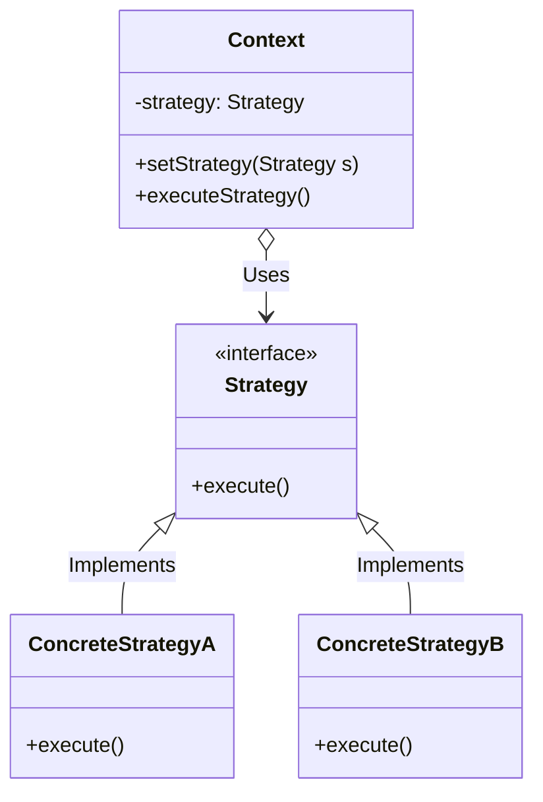
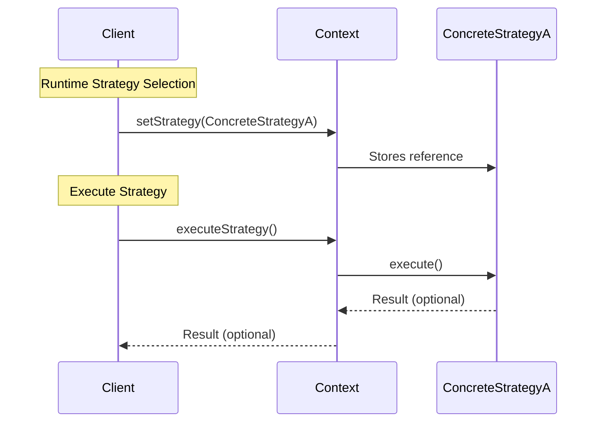

```mermaid
classDiagram
    class Context {
        -strategy: Strategy
        +setStrategy(Strategy s)
        +executeStrategy()
    }

    class Strategy {
        <<interface>>
        +execute()
    }

    class ConcreteStrategyA {
        +execute()
    }

    class ConcreteStrategyB {
        +execute()
    }

    Context o--> Strategy : Uses
    Strategy <|-- ConcreteStrategyA : Implements
    Strategy <|-- ConcreteStrategyB : Implements
```

```mermaid
sequenceDiagram
    participant Client
    participant Context
    participant Strategy as ConcreteStrategyA

    Note over Client: Runtime Strategy Selection
    Client ->> Context: setStrategy(ConcreteStrategyA)
    Context ->> Strategy: Stores reference

    Note over Client: Execute Strategy
    Client ->> Context: executeStrategy()
    Context ->> Strategy: execute()
    Strategy -->> Context: Result (optional)
    Context -->> Client: Result (optional)
```
