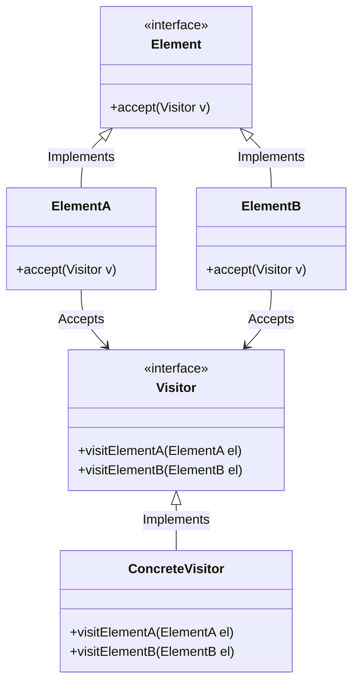
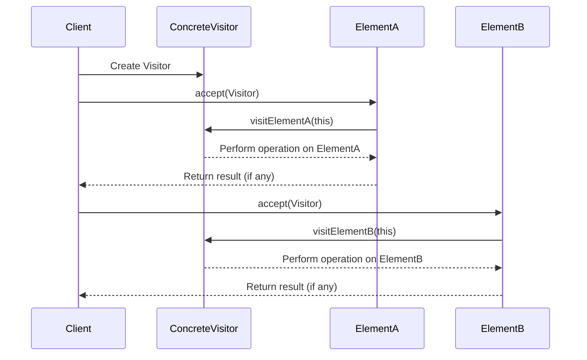

## Visitor Pattern

The Visitor Pattern is a behavioral design pattern that lets you add new operations to existing
object structures without modifying the structures themselves. It is particularly useful when
you have a stable class hierarchy but need to perform operations that are subject to frequent change.

Core Principles
1. *Separation of Concerns*: The object structure (e.g., a composite of shapes or AST nodes) stays
   stable; new behavior is encapsulated in visitor classes.
2. *Double Dispatch*: The pattern uses two polymorphic calls—first to the accept() method of the
   element, then to the visit() method of the visitor—which lets you dynamically dispatch both
   on the object and the operation.
3. *Extensibility*: New operations can be added by creating new visitors, without changing the
   element classes.

Basic Structure
- *Element Interface*: Has an accept(visitor) method.
- *Concrete Elements*: Implement accept() and call back visitor.visit(this).
- *Visitor Interface*: Declares visit() methods for each concrete element.
- *Concrete Visitors*: Implement operations for each element.







### Example in C

C doesn’t support OOP directly, so we simulate with function pointers and structs.

```c
#include <stdio.h>

struct Circle;
struct Rectangle;
struct ShapeVisitor;

// shape interface
typedef struct Shape {
    void (*accept)(struct Shape* self, struct ShapeVisitor* visitor);
} Shape;

// visitor interface
typedef struct ShapeVisitor {
    void (*visit_circle)(struct ShapeVisitor*, struct Circle*);
    void (*visit_rectangle)(struct ShapeVisitor*, struct Rectangle*);
} ShapeVisitor;


typedef struct Circle {
    Shape base;
    int radius;
} Circle;

void circle_accept(Shape* self, ShapeVisitor* visitor) {
    visitor->visit_circle(visitor, (Circle*)self);
}


typedef struct Rectangle {
    Shape base;
    int width, height;
} Rectangle;

void rectangle_accept(Shape* self, ShapeVisitor* visitor) {
    visitor->visit_rectangle(visitor, (Rectangle*)self);
}


void visit_circle_print(ShapeVisitor* self, Circle* c) {
    printf("Circle with radius %d\n", c->radius);
}

void visit_rectangle_print(ShapeVisitor* self, Rectangle* r) {
    printf("Rectangle %dx%d\n", r->width, r->height);
}

ShapeVisitor PrintVisitor = {
    .visit_circle = visit_circle_print,
    .visit_rectangle = visit_rectangle_print
};


int main() {
    Circle c = { .base.accept = circle_accept, .radius = 5 };
    Rectangle r = { .base.accept = rectangle_accept, .width = 3, .height = 4 };

    c.base.accept((Shape*)&c, &PrintVisitor);
    r.base.accept((Shape*)&r, &PrintVisitor);
}
```


### Example in Python

Python has dynamic typing, so it’s more concise:

```python
class ShapeVisitor:
    def visit_circle(self, circle): pass
    def visit_rectangle(self, rectangle): pass

class Shape:
    def accept(self, visitor): pass

class Circle(Shape):
    def __init__(self, radius):
        self.radius = radius
    def accept(self, visitor):
        visitor.visit_circle(self)

class Rectangle(Shape):
    def __init__(self, width, height):
        self.width = width
        self.height = height
    def accept(self, visitor):
        visitor.visit_rectangle(self)

class PrintVisitor(ShapeVisitor):
    def visit_circle(self, circle):
        print(f"Circle with radius {circle.radius}")
    def visit_rectangle(self, rectangle):
        print(f"Rectangle {rectangle.width}x{rectangle.height}")


shapes = [Circle(5), Rectangle(3, 4)]
visitor = PrintVisitor()
for shape in shapes:
    shape.accept(visitor)
```


### Extend Visitor Pattern

Here is a Python Visitor Pattern example that is both extensible (easily supports new visitors)
and works well with complex object graphs, such as composite structures.


Design Goals
- Add new operations without modifying the node classes.
- Allow nesting (i.e., visitors can recursively visit components).
- Support structured objects (like ASTs or shape groups).


Implementation: Composite + Visitor

```python
from abc import ABC, abstractmethod

# base class

class Shape(ABC):
    @abstractmethod
    def accept(self, visitor):
        pass

# leafs

class Circle(Shape):
    def __init__(self, radius):
        self.radius = radius

    def accept(self, visitor):
        return visitor.visit_circle(self)

class Rectangle(Shape):
    def __init__(self, width, height):
        self.width = width
        self.height = height

    def accept(self, visitor):
        return visitor.visit_rectangle(self)

# composite

class Group(Shape):
    def __init__(self, name):
        self.name = name
        self.children = []

    def add(self, shape: Shape):
        self.children.append(shape)

    def accept(self, visitor):
        return visitor.visit_group(self)

# visitor base class

class ShapeVisitor(ABC):
    @abstractmethod
    def visit_circle(self, circle: Circle):
        pass

    @abstractmethod
    def visit_rectangle(self, rectangle: Rectangle):
        pass

    @abstractmethod
    def visit_group(self, group: Group):
        pass

# concrete visitor: printer

class PrintVisitor(ShapeVisitor):
    def __init__(self):
        self.indent = 0

    def _pad(self):
        return "  " * self.indent

    def visit_circle(self, circle: Circle):
        print(f"{self._pad()}Circle(radius={circle.radius})")

    def visit_rectangle(self, rectangle: Rectangle):
        print(f"{self._pad()}Rectangle(width={rectangle.width}, height={rectangle.height})")

    def visit_group(self, group: Group):
        print(f"{self._pad()}Group({group.name})")
        self.indent += 1
        for child in group.children:
            child.accept(self)
        self.indent -= 1
```

Usage Example

```python
if __name__ == "__main__":
    # build a complex structure
    g1 = Group("root")
    g1.add(Circle(5))
    g1.add(Rectangle(2, 3))

    g2 = Group("subgroup")
    g2.add(Rectangle(4, 4))
    g2.add(Circle(1))
    g1.add(g2)

    # apply a visitor
    printer = PrintVisitor()
    g1.accept(printer)
```

Output

```shell
Group(root)
  Circle(radius=5)
  Rectangle(width=2, height=3)
  Group(subgroup)
    Rectangle(width=4, height=4)
    Circle(radius=1)
```

Adding a New Visitor (e.g., AreaCalculator)

```python
class AreaVisitor(ShapeVisitor):
    def visit_circle(self, circle: Circle):
        return 3.14 * circle.radius ** 2

    def visit_rectangle(self, rectangle: Rectangle):
        return rectangle.width * rectangle.height

    def visit_group(self, group: Group):
        return sum(child.accept(self) for child in group.children)

area = g1.accept(AreaVisitor())
print("Total area:", area)
```

Summary
- The object structure (Circle, Rectangle, Group) is untouched when adding new operations.
- New operations (PrintVisitor, AreaVisitor, etc.) are added by subclassing the visitor.
- Recursion and nesting are naturally supported in Group.

