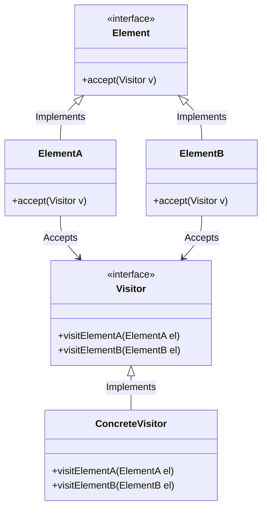

```mermaid
classDiagram
    %% ====== Visitor Pattern ======
    class Visitor {
        <<interface>>
        +visitElementA(ElementA el)
        +visitElementB(ElementB el)
    }

    class Element {
        <<interface>>
        +accept(Visitor v)
    }

    class ConcreteVisitor {
        +visitElementA(ElementA el)
        +visitElementB(ElementB el)
    }

    class ElementA {
        +accept(Visitor v)
    }

    class ElementB {
        +accept(Visitor v)
    }

    Visitor <|-- ConcreteVisitor : Implements
    Element <|-- ElementA : Implements
    Element <|-- ElementB : Implements
    ElementA --> Visitor : Accepts
    ElementB --> Visitor : Accepts
```
