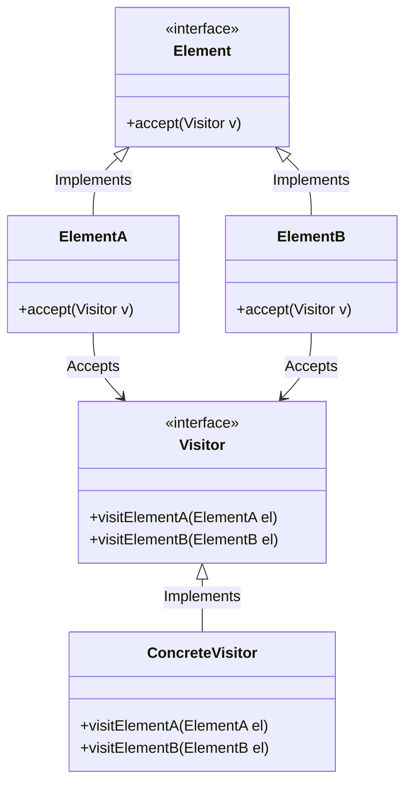
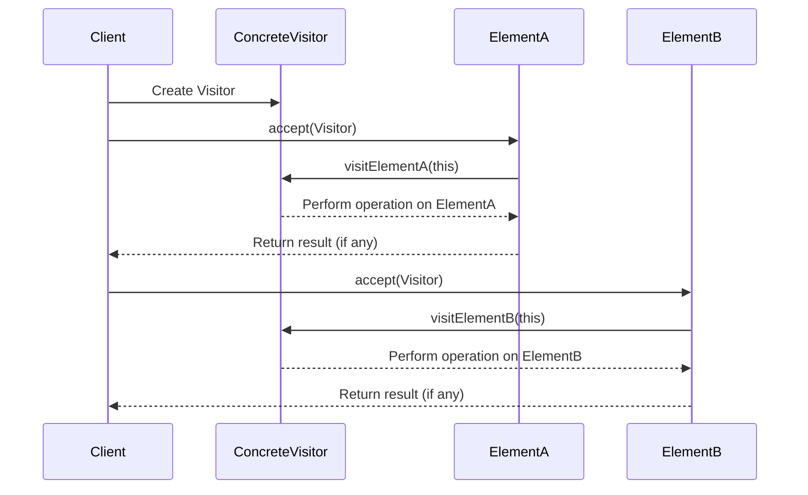

```mermaid
classDiagram
    %% ====== Visitor Pattern ======
    class Visitor {
        <<interface>>
        +visitElementA(ElementA el)
        +visitElementB(ElementB el)
    }

    class Element {
        <<interface>>
        +accept(Visitor v)
    }

    class ConcreteVisitor {
        +visitElementA(ElementA el)
        +visitElementB(ElementB el)
    }

    class ElementA {
        +accept(Visitor v)
    }

    class ElementB {
        +accept(Visitor v)
    }

    Visitor <|-- ConcreteVisitor : Implements
    Element <|-- ElementA : Implements
    Element <|-- ElementB : Implements
    ElementA --> Visitor : Accepts
    ElementB --> Visitor : Accepts
```

```mermaid
sequenceDiagram
    participant Client
    participant Visitor as ConcreteVisitor
    participant ElementA
    participant ElementB

    Client ->> Visitor: Create Visitor
    Client ->> ElementA: accept(Visitor)
    ElementA ->> Visitor: visitElementA(this)
    Visitor -->> ElementA: Perform operation on ElementA
    ElementA -->> Client: Return result (if any)

    Client ->> ElementB: accept(Visitor)
    ElementB ->> Visitor: visitElementB(this)
    Visitor -->> ElementB: Perform operation on ElementB
    ElementB -->> Client: Return result (if any)
```
