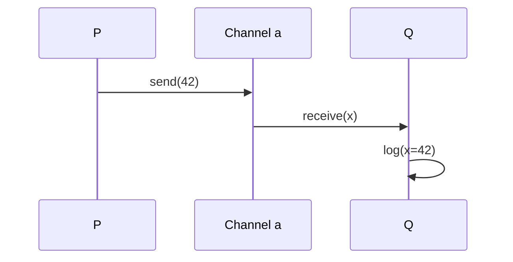
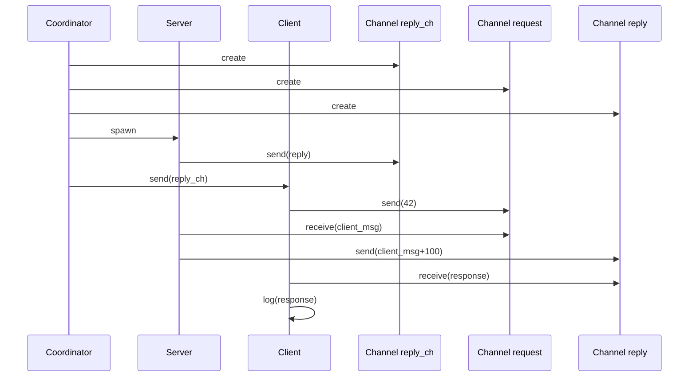
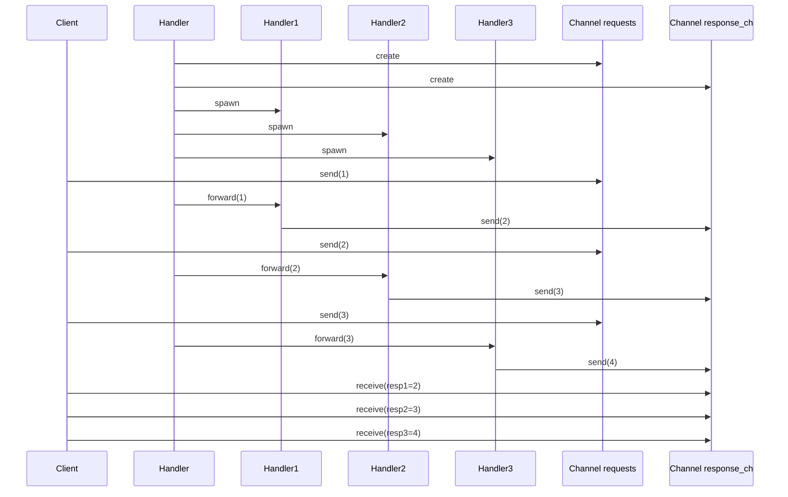

## π-vm

### 1. Basic Example (P and Q)

```pi-calculus
P = a!⟨42⟩.0
Q = a?(x).log⟨x⟩.0

System = (νa)(P | Q)
```
* `P` sends value `42` on channel `a` then terminates (`0`)
* `Q` receives on `a` (binding to `x`), logs it, then terminates
* The system creates a private channel `a` (`νa`) for communication




### 2. Advanced Example (Client-Server-Coordinator)

```pi-calculus
Server = reply_ch?(reply).request?(client_msg).reply!⟨client_msg+100⟩.0

Client = reply_ch?(server_reply_ch).request!⟨42⟩.server_reply_ch?(response).log⟨response⟩.0

Coordinator = (νrequest)(νreply_ch)(νreply)(
                reply_ch!⟨reply⟩.0 
                | reply_ch!⟨reply⟩.0
              )

System = (Server | Client | Coordinator)
```

Features:
- Coordinator creates 3 private channels (`νrequest,νreply_ch,νreply`)
- Sends `reply` channel twice (to Server and Client)
- Server receives the reply channel first, then processes requests
- Client gets response on dynamically provided channel




### 3. Replication Example (Request Handlers)

```pi-calculus
(* Handler processes *)
Handler1 = handler1?(req).response!⟨req+1⟩.0
Handler2 = handler2?(req).response!⟨req+1⟩.0 
Handler3 = handler3?(req).response!⟨req+1⟩.0

(* Main handler with replication *)
RequestHandler = (νrequests)(νresponse)(νhandler1)(νhandler2)(νhandler3)(
                  requests?(req1).handler1!⟨req1⟩.0
                  | requests?(req2).handler2!⟨req2⟩.0
                  | requests?(req3).handler3!⟨req3⟩.0
                  | Handler1 | Handler2 | Handler3
                )

Client = requests!⟨1⟩.requests!⟨2⟩.requests!⟨3⟩.
         response?(resp1).response?(resp2).response?(resp3).
         log⟨resp1⟩.log⟨resp2⟩.log⟨resp3⟩.0

System = (RequestHandler | Client)
```




### π-calculus concepts mapped
1. *Channel creation* `(νx)` ↔ `new_channel`  
2. *Send* `x!⟨v⟩` ↔ `send(x,v)`  
3. *Receive* `x?(y)` ↔ `receive(x,y)`  
4. *Parallel* `P|Q` ↔ `spawn`/threading  
5. *Replication* `!P` ↔ Your `replicate` operation  


### Extended Example with Select

For the `select` operation, here's a π-calculus equivalent using guarded choice:
```pi-calculus
P = τ.(x?(y).P1 + y?(z).P2 + timeout.P3
```
(Where `+` represents non-deterministic choice between guarded processes)
