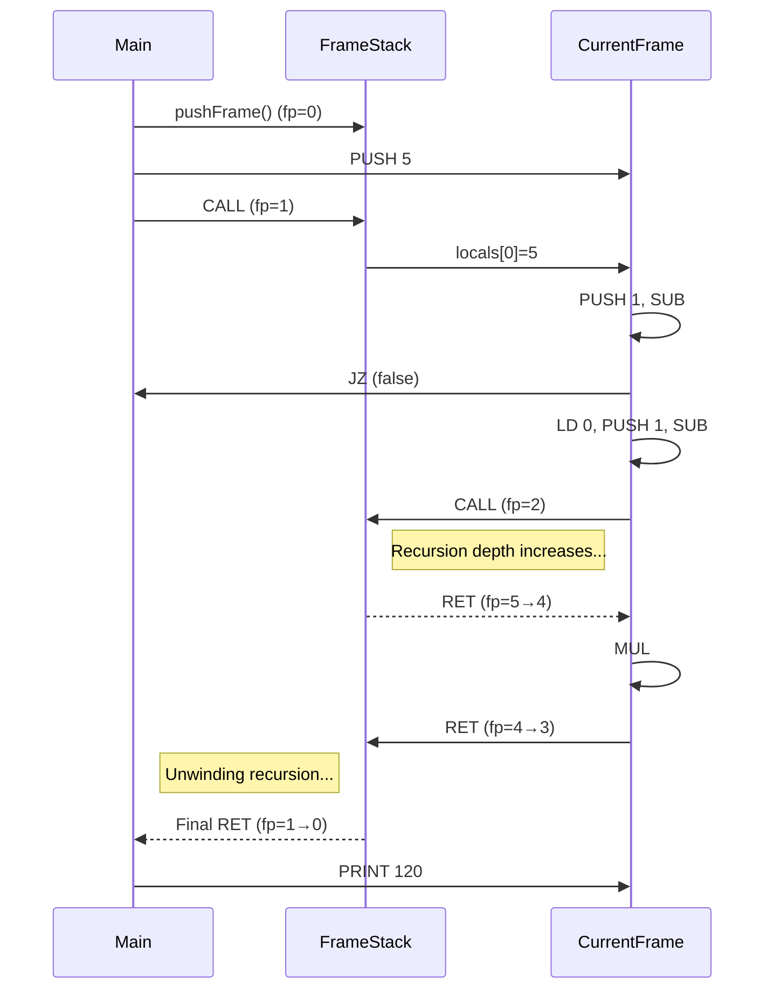

## Frame Stacks

You should be familiar with frame stacks already. We have introduced them early.
The code provides an example of a frame stack implementation in a virtual machine.
Actually it is the same as we used in [ch02](./../../../ch02/vm4/): vm4.c.

1. A representation of frames (with locals, stack, return values, etc.)
2. A frame stack data structure that manages multiple frames
3. Operations for pushing/popping frames during function calls
4. State transfer between frames (arguments, return values)

This is a implementation that illustrates the key concepts of frame stacks in a
stack-based virtual machine. The code implements a simple VM capable of executing
bytecode with function calls, including recursion, as demonstrated by the factorial
calculation example.


### What Are Frame Stacks?

A frame stack (or call stack) is a data structure that stores information about
the active function calls in a program. Each time a function is called, a new
"frame" is created and pushed onto the stack. When a function returns, its
frame is popped from the stack.


### Core Components of a Frame Stack

1. *Stack Frames*: Each frame typically contains:
   - *Local variables*: Variables defined within the function
   - *Parameters*: Values passed to the function
   - *Return address*: Where to resume execution after the function returns
   - *Operand stack*: For stack-based VMs/languages to handle expression evaluation
   - *Return value slot*: Space for the function's return value

2. *Frame Pointer (FP)*: Points to the current active frame in the stack
   
3. *Stack Pointer (SP)*: Points to the top of the operand stack within a frame

### How Frame Stacks Work

#### Function Call Flow:
1. *Preparation*: Caller evaluates and pushes arguments onto its stack
2. *Frame Creation*: A new frame is allocated on the frame stack
3. *Parameter Transfer*: Arguments are transferred from caller's stack to callee's locals
4. *Return Address Storage*: The return address is saved in the new frame
5. *Control Transfer*: Execution jumps to the function code

#### Function Return Flow:
1. *Return Value Preparation*: Function computes return value
2. *Frame Cleanup*: Current frame is popped from the frame stack
3. *Result Transfer*: Return value is passed to the calling frame
4. *Control Return*: Execution resumes at the stored return address

### Importance of Frame Stacks

1. *Function Implementation*: They enable function calls and recursion
2. *Execution Context*: They maintain the state and context of each function
3. *Memory Management*: They provide structured memory allocation for functions
4. *Debugging Support*: Stack traces show the call hierarchy during errors

### Frame Stack Variations

Different languages and VMs implement frame stacks with various optimizations:

1. *Contiguous Frames*: Some systems allocate frames contiguously in memory
2. *Linked Frames*: Others link frames through pointers (like in your example)
3. *Register Windows*: Some architectures (like SPARC) use register windows instead of memory frames
4. *Optimized Returns*: Tail-call optimization can avoid frame creation in recursive calls

### Advanced Concepts Related to Frame Stacks

1. *Stack Overflow*: Occurs when too many nested function calls exceed stack space
2. *Activation Records*: Another term for stack frames in compiler theory
3. *Dynamic Linking*: Frame stacks help resolve function addresses at runtime
4. *Exception Handling*: Uses stack unwinding to find exception handlers
5. *Closures*: Require preserving stack frames beyond their normal lifetime


### Frame Stacks in Different Contexts

#### Compiled Languages (C/C++):
- Fixed-size frames determined at compile time
- Efficient but less flexible

#### Interpreted Languages (Python/JavaScript):
- Dynamic frames that can grow/shrink
- Support for closures and first-class functions

#### Virtual Machines (JVM/CLR):
- Platform-independent frame representation
- Support for garbage collection and security checks

#### Operating Systems:
- User space stacks for application code
- Kernel stacks for system calls and interrupts


### Visualisation of a Frame Stack

Let me illustrate a frame stack during the factorial calculation from your code:

When calculating factorial(5):

```
Frame 3 (factorial(1)): [locals: n=1, returnAddr=20]
                         [stack: 1]
Frame 2 (factorial(2)): [locals: n=2, returnAddr=20]
                         [stack: 2, <factorial(1)=1>]
Frame 1 (factorial(3)): [locals: n=3, returnAddr=20]
                         [stack: 3, <factorial(2)=2>]
Frame 0 (factorial(4)): [locals: n=4, returnAddr=20]
                         [stack: 4, <factorial(3)=6>]
Main Frame:             [locals: ]
                         [stack: 5, <factorial(4)=24>]
```



Each frame maintains its own state, allowing the recursive calls to factorial to work correctly.

### Conclusion

The provided code is an example of frame stack implementation in a bytecode virtual machine. It
demonstrates the key concepts of frame management, including frame creation/destruction, parameter
passing, and return value handling. The implementation also handles the complexities of recursiv
function calls as shown in the factorial example.
