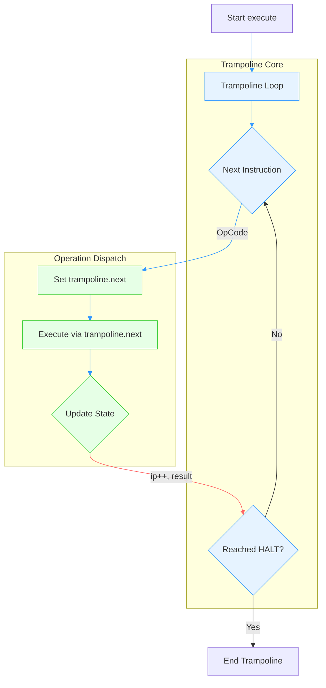

## Trampoline

The trampoline pattern is a programming technique primarily used to optimise recursion and manage control flow,
especially in cases where recursion might otherwise lead to stack overflow or be inefficient. It allows for
simulating recursion without the risk of deep stack calls by using an iterative approach instead. Let's break
down both its general concept and its application to a interpreter example.


__1. Trampoline Pattern in General__

The trampoline pattern can be considered as a "control flow" pattern used to replace recursive calls with an
iterative loop. The key idea is to maintain the "next action" to be performed, which can be either a recursive
call or a function call, and execute it in a controlled manner, avoiding deep call stacks.

Characteristics:

- Avoids Deep Recursion: The trampoline pattern is often used in functional programming to avoid deep recursion
  that could lead to stack overflow errors. In languages that don't optimise tail calls, deep recursion could
  be problematic (overflow).

- Iterative Execution: Instead of using function calls to implement recursion, the trampoline pattern uses a
  loop that "repeatedly" executes the next action until the final result is achieved.

- Composable: Each "step" or "action" is returned as another "action" or "function" to be performed. This
  makes it easy to compose different actions.

- Lazy Evaluation: Actions are performed only when needed, and the next action is dynamically determined.


How It Works:

1. Return a Callable: A recursive function doesn't directly make the recursive call but instead returns
   a function or "action" (often in the form of a closure or callback).

2. Loop Until Done: A loop (often called a trampoline) will keep calling the "next" action until the final
   result is achieved.

Example of a Trampoline for Factorial Calculation (without stack overflow):

```python
def factorial_trampoline(n):
    def step(n, accumulator):
        if n == 0:
            return accumulator
        else:
            return lambda: step(n - 1, n * accumulator)
    
    result = step(n, 1)
    while callable(result):
        result = result()  # next step
    return result  # final

print(factorial_trampoline(5))  # Output: 120
```

In this example:
- 'step' is the recursive action that is returned as a callable. Instead of
  calling itself directly, it returns another function.
- The loop repeatedly executes the returned actions until a result is found
  (i.e., when no further function is returned).


__2. Trampoline in the Context of an Interpreter__

A more conventional implementation of the trampoline pattern can be seen in the example in the
[continuation](./../continue/) folder.

In the context of the interpreter, the trampoline pattern is being used to handle the execution of various
instructions in a modular way. Each instruction, such as ADD, MUL, DIV, or HALT, is represented by a
corresponding "action" or function pointer. The 'trampoline.next' serves as the control mechanism, directing
the interpreter to the next operation based on the current instruction.

How It Works in the Interpreter:

- Instruction Handling: Instead of using a conventional switch or if statement that directly executes an
  instruction, you use 'trampoline.next' to point to the correct function (e.g., add, mul, div, etc.).
  The loop continues by calling the function pointed to by 'trampoline.next', which then performs the
  operation and possibly returns another action.

- Modular Action Execution: Each action (such as add, mul, div, etc.) is encapsulated as a function, and
  'trampoline.next' determines which one to execute next.

- Avoid Deep Recursion: While the interpreter isn't (directly) recursive, the trampoline pattern ensures
  that operations are executed one-by-one, allowing for easy extension of the interpreter by just adding
  more operations or steps, without deeply nesting calls.

```c
switch (inst->op) {
    case ADD:
        trampoline.next = add;
        break;
    case SUB:
        trampoline.next = sub;
        break;
    case MUL:
        trampoline.next = mul;
        break;
    case DIV:
        trampoline.next = fixed_point_div;
        break;
    case HALT:
        trampoline.next = halt;
        break;
    default:
        printf("Unknown operation\n");
        break;
}

// next operation ..
if (trampoline.next != NULL) {
    trampoline.next(interpreter);
}
```

Each operation, like add, is associated with a function pointer (trampoline.next), and the interpreter
uses this pointer to determine what to execute next. The key is that: *the interpreter doesn't execute
operations directly or recursively; it just points to the next operation to be performed*.


Benefits:

1. Extensibility: New instructions can be added easily by simply defining new functions and associating
   them with new opcodes in the instruction set. This is more modular than a complex set of conditionals.

2. Control Flow Separation: The logic for controlling the flow of the interpreter (which operation to
   execute next) is separated from the actual operations (add, sub, mul, etc.), making the code cleaner
   and easier to manage.

3. Flexibility: The trampoline pattern allows you to dynamically choose the next operation during the
   interpretation process, which is a natural fit for implementing a stack-based or VM-style interpreter.

4. Simplified Debugging: The ability to insert debug prints or trace information after each instruction
   is executed helps ensure that the flow of control is correct.

Considerations:

- State Management: The trampoline pattern in your case is somewhat tied to managing the state of the
  interpreter (through interpreter->result, interpreter->ip, etc.). While the pattern itself is simple,
  careful management of the interpreter state is crucial to ensure correct results.

- Memory Efficiency: If your interpreter ever becomes more complex, and if you start chaining more complex
  operations, you might find that keeping track of all those function calls in a trampoline pattern might
  become harder to manage. You'll have to decide whether it's better to have a strict loop structure or
  something more flexible like trampoline recursion.


__3. C Example__

The trampoline mechanism from sample 'tramp.c':




### Conclusion

The trampoline pattern works well for controlling the flow of execution in a modular way. It separates
out the actions and the control flow, making it easier to extend, debug, and maintain. This pattern is
especially useful in cases like yours where you need to execute a series of actions (e.g., arithmetic
operations) in a controlled, stateful manner, and the interpreter may need to dynamically choose what
to do next based on the current instruction.
