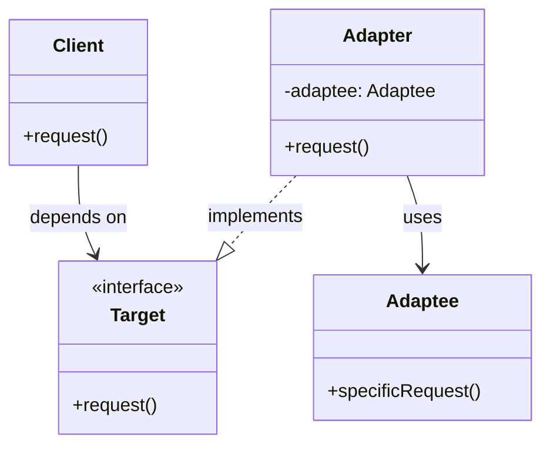

## Adapter Design Pattern

Convert the interface of a class into another interface the client expects. Adapter lets
classes work together that couldn't otherwise because of incompatible interfaces.

### Problem Context

Say you want to reuse some existing code (a class, library, or module), but it does not
match the interface your system expects. You cannot or do not want to modify the existing code.


__Participants__

1. *Client*
Expects to use the Target interface.

2. *Target*
An interface expected by the client.

3. *Adaptee*
The existing class with an incompatible interface.

4. *Adapter*
Translates the Target interface into the Adaptee's interface.


### Variations

- *Class Adapter* (uses inheritance)

  The adapter inherits from both Target and Adaptee. Only available in languages
  that support multiple inheritance (e.g., C++, Python).

- *Object Adapter* (uses composition)

  The adapter has a reference to an Adaptee instance. This is the most common
  and flexible approach.





### Python Example (Object Adapter)

```python
# legacy or third-party class
class Adaptee:
    def specific_request(self):
        return "Result from Adaptee.specific_request()"

# Target interface expected by client
class Target:
    def request(self):
        raise NotImplementedError("Must override request")

# Adapter that converts Target calls to Adaptee methods
class Adapter(Target):
    def __init__(self, adaptee: Adaptee):
        self.adaptee = adaptee

    def request(self):
        # translate request to adaptee's method
        result = self.adaptee.specific_request()
        return f"Adapter translated: {result}"

# Client code
def client_code(target: Target):
    print(target.request())

adaptee = Adaptee()
adapter = Adapter(adaptee)
client_code(adapter)
```

### Use Cases

- Integrating legacy components with a new system.
- Working with third-party libraries whose interfaces cannot be changed.
- Bridging between different protocols or data formats.

Real-World Examples
- Java I/O Streams: InputStreamReader adapts a byte stream (InputStream) to a character stream (Reader).
- Python file-like wrappers: io.TextIOWrapper adapts a BufferedIOBase to TextIOBase.
- Adapters in GUI toolkits: When integrating new UI widgets that don't follow the expected interface.


Advantages
- Promotes reuse of existing functionality.
- Provides flexibility in integrating different modules.
- Adheres to Open/Closed Principle--adaptee classes don't need to be modified.

Limitations
- Can introduce extra indirection and boilerplate.
- Overuse can make design more complex and harder to trace.
