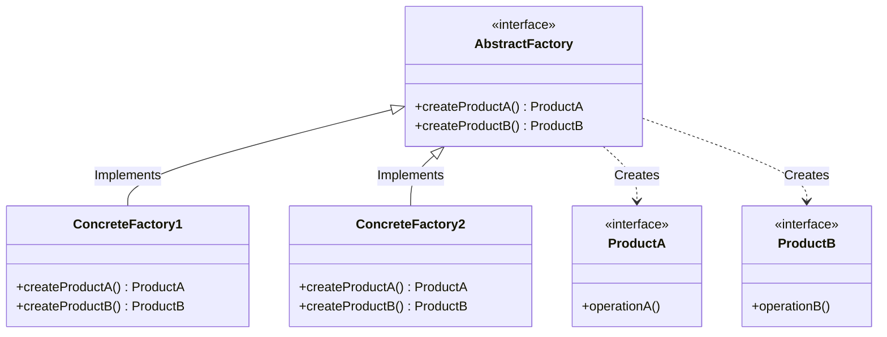
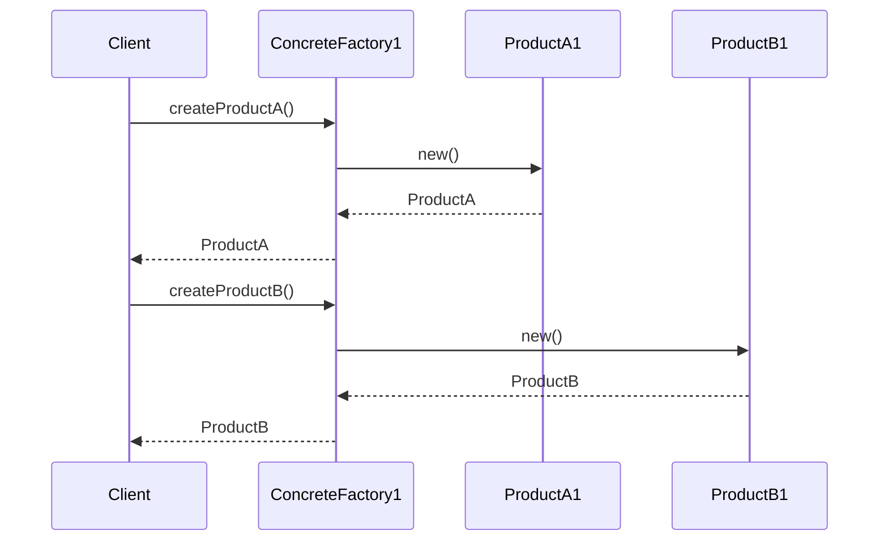

## Abstract Factory

```mermaid
classDiagram
    class AbstractFactory {
        <<interface>>
        +createProductA() ProductA
        +createProductB() ProductB
    }

    class ConcreteFactory1 {
        +createProductA() ProductA
        +createProductB() ProductB
    }

    class ConcreteFactory2 {
        +createProductA() ProductA
        +createProductB() ProductB
    }

    class ProductA {
        <<interface>>
        +operationA()
    }

    class ProductB {
        <<interface>>
        +operationB()
    }

    AbstractFactory <|-- ConcreteFactory1 : Implements
    AbstractFactory <|-- ConcreteFactory2 : Implements
    AbstractFactory ..> ProductA : Creates
    AbstractFactory ..> ProductB : Creates
```

```mermaid
sequenceDiagram
    participant Client
    participant ConcreteFactory1
    participant ProductA1
    participant ProductB1

    Client ->> ConcreteFactory1: createProductA()
    ConcreteFactory1 ->> ProductA1: new()
    ProductA1 -->> ConcreteFactory1: ProductA
    ConcreteFactory1 -->> Client: ProductA

    Client ->> ConcreteFactory1: createProductB()
    ConcreteFactory1 ->> ProductB1: new()
    ProductB1 -->> ConcreteFactory1: ProductB
    ConcreteFactory1 -->> Client: ProductB
```

