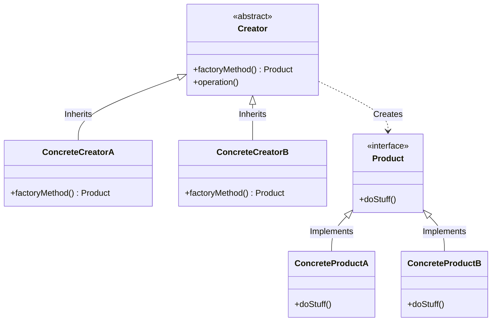
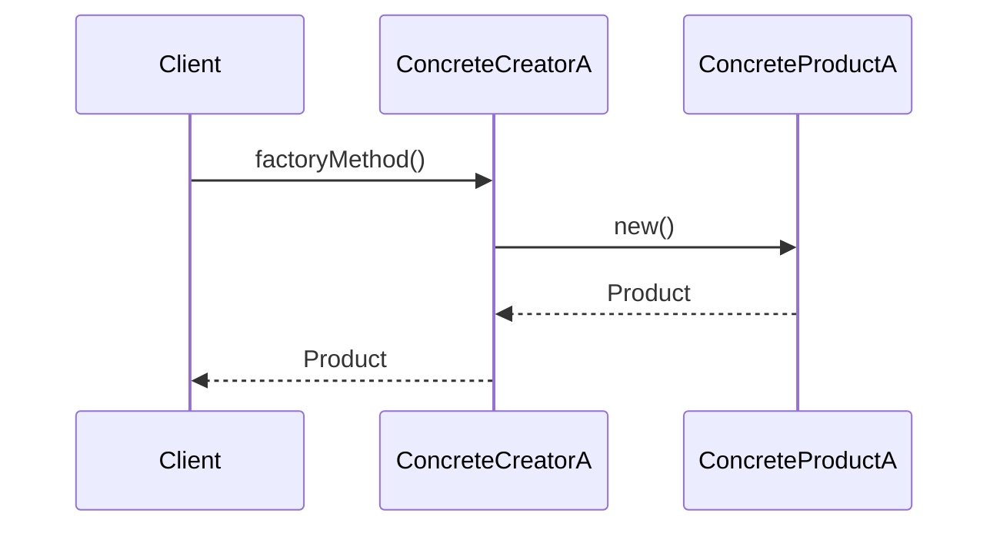

## Factory Method

```mermaid
classDiagram
    class Creator {
        <<abstract>>
        +factoryMethod() Product
        +operation()
    }

    class ConcreteCreatorA {
        +factoryMethod() Product
    }

    class ConcreteCreatorB {
        +factoryMethod() Product
    }

    class Product {
        <<interface>>
        +doStuff()
    }

    class ConcreteProductA {
        +doStuff()
    }

    class ConcreteProductB {
        +doStuff()
    }

    Creator <|-- ConcreteCreatorA : Inherits
    Creator <|-- ConcreteCreatorB : Inherits
    Product <|-- ConcreteProductA : Implements
    Product <|-- ConcreteProductB : Implements
    Creator ..> Product : Creates
```

```mermaid
sequenceDiagram
    participant Client
    participant ConcreteCreatorA
    participant ConcreteProductA

    Client ->> ConcreteCreatorA: factoryMethod()
    ConcreteCreatorA ->> ConcreteProductA: new()
    ConcreteProductA -->> ConcreteCreatorA: Product
    ConcreteCreatorA -->> Client: Product
```

