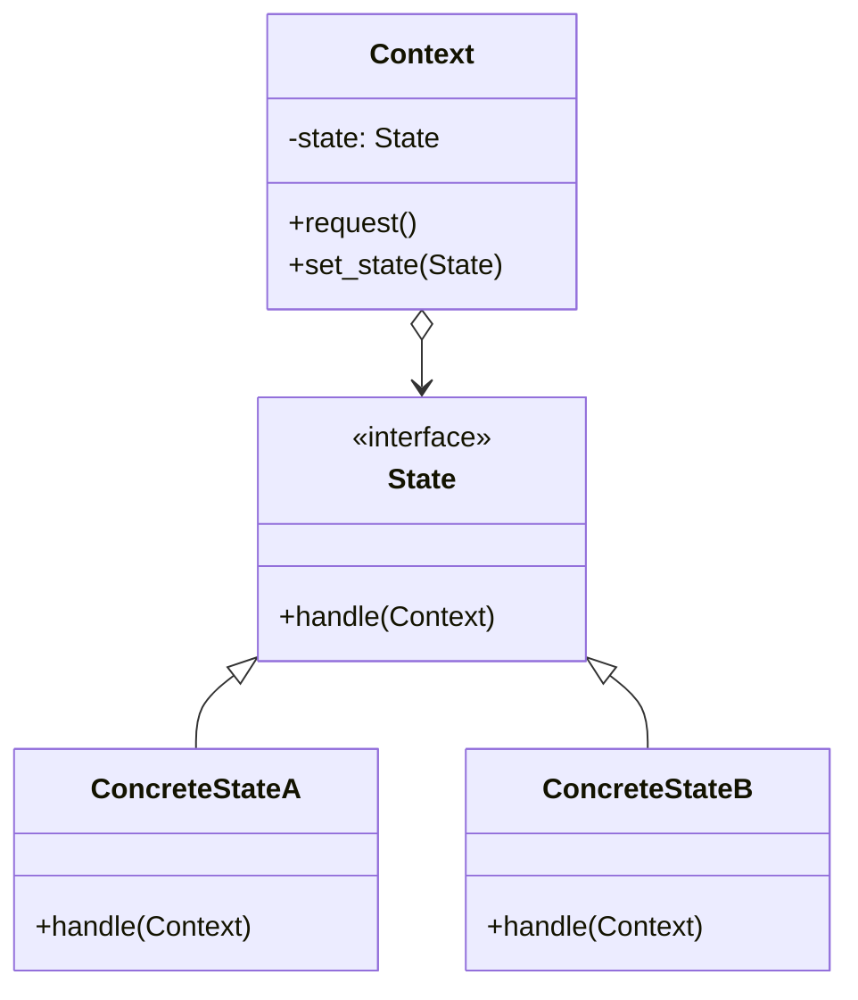

## State Design Pattern

The State Design Pattern allows an object to alter its behavior when its internal state changes,
making it appear as if the object has changed its class. This pattern is particularly useful for
replacing complex conditional logic with modular state-specific behavior.


### Basic State Machine Implementation

A simple state machine in C might use function pointers to switch between states:

```c
#include <stdio.h>

typedef void (*StateFunction)();

// state functions
void state_on() { printf("State: ON -> turning OFF\n"); }
void state_off() { printf("State: OFF -> turning ON\n"); }

typedef struct {
    StateFunction current;
} Switch;

int main() {
    Switch sw = {.current = state_off};
    
    sw.current();  // OFF -> ON
    sw.current = state_on;
    sw.current();  // ON -> OFF

    return 0;
}
```

While functional, this approach lacks encapsulation and makes state transitions explicit in the client code.


### State Pattern Implementation

The State Pattern formalises this by:
1. Encapsulating states as first-class entities
2. Delegating behavior to state objects
3. Managing transitions within states themselves

```c
#include <stdio.h>
#include <stdlib.h>

typedef struct State State;
typedef struct Context Context;

struct State {
    void (*handle)(Context* ctx);
};

struct Context {
    State* state;
    void (*set_state)(Context*, State*);
};

// concrete States
void handle_on(Context* ctx);
void handle_off(Context* ctx);

State ON = { handle_on };
State OFF = { handle_off };

void set_state(Context* ctx, State* s) {
    ctx->state = s;
}

void handle_on(Context* ctx) {
    printf("State is ON -> switching to OFF\n");
    ctx->set_state(ctx, &OFF);
}

void handle_off(Context* ctx) {
    printf("State is OFF -> switching to ON\n");
    ctx->set_state(ctx, &ON);
}

int main() {
    Context ctx = { .state = &OFF, .set_state = set_state };
    ctx.state->handle(&ctx); // OFF -> ON
    ctx.state->handle(&ctx); // ON -> OFF
    return 0;
}
```

The Context is the central object that holds the current state, delegates behavior to the state
via `state->handle(ctx)`, provides a mechanism (`set_state`) to change the state, and allows states
to modify the context by calling this mechanism (for example, `ctx->set_state(ctx, &ON)`).


### Object-Oriented Implementation

In OOP languages, the pattern is more naturally expressed:

```python
class State:
    def handle(self, context): pass

class OnState(State):
    def handle(self, context):
        print("State is ON -> switching to OFF")
        context.state = OffState()

class OffState(State):
    def handle(self, context):
        print("State is OFF -> switching to ON")
        context.state = OnState()

class Context:
    def __init__(self):
        self.state = OffState()
    
    def request(self):
        self.state.handle(self)

ctx = Context()
ctx.request()  # OFF -> ON
ctx.request()  # ON -> OFF
```


### Conclusion



#### Advantages
- *Eliminates conditional complexity*: Replaces state-conditioned behavior with polymorphism
- *Single Responsibility Principle*: Each state encapsulates its own behavior
- *Open/Closed Principle*: New states can be added without modifying existing code
- *Explicit state transitions*: Transitions become part of the state's behavior

#### Implementation Notes
1. *Context*: Maintains the current state and delegates requests to it
2. *State Interface*: Defines the common interface for all concrete states
3. *Concrete States*: Implement behavior specific to a particular state

#### Use
- When an object's behavior depends on its state and changes frequently
- When you have many conditional statements that switch on the same state variable
- When you need clean state-specific behavior organization

#### Trade-offs
- *Overhead*: May introduce more classes than a simple conditional approach
- *State awareness*: States may need knowledge of other states for transitions
- *Initial complexity*: Simpler state machines might not benefit from this pattern
