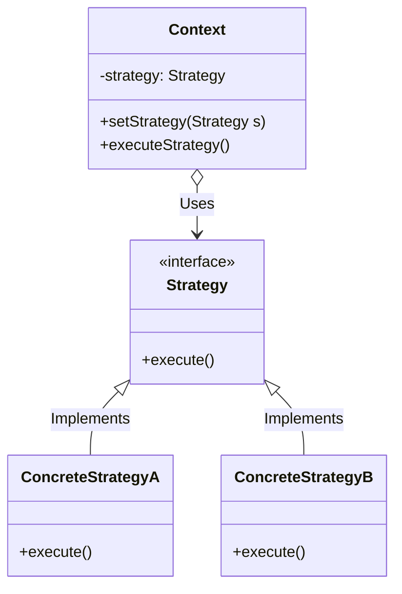
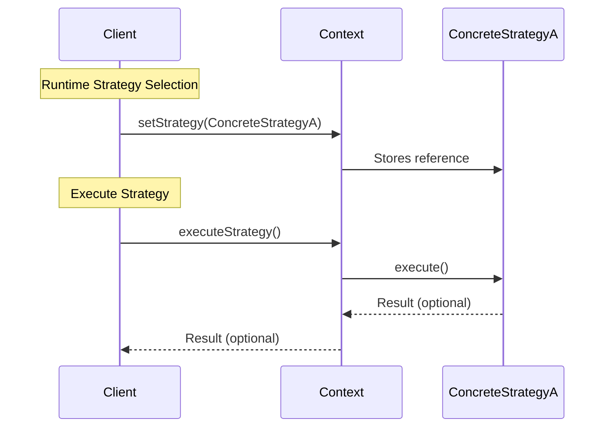

## Strategy Pattern

The Strategy Pattern is a behavioral design pattern that enables selecting an algorithm's
behavior at runtime. Instead of implementing a single algorithm directly, the code receives
the algorithm via a strategy interface. This makes it easy to swap different algorithms
without modifying the client using them.

Components:
- Strategy Interface: An abstraction for a family of algorithms (e.g., SortingStrategy or SortFunction).
- Concrete Strategies: Different implementations of the algorithm (e.g., bubble sort, quicksort).
- Context: A class (e.g., Sorter) that uses a strategy and delegates the actual work to it.
- Client: Code that configures the context with a strategy and invokes behavior.

Benefits:
- Follows Open/Closed Principle (open for extension, closed for modification).
- Avoids conditional logic for selecting behavior.
- Strategies are interchangeable and reusable.


A class diagram as example:


Use:



### C Example

```c
typedef void (*SortFunction)(int*, size_t);
```

This defines the Strategy Interface using a function pointer type.

```c
void bubble_sort(int* arr, size_t size) { ... }
void quick_sort(int* arr, size_t size) { ... }
````

These are the Concrete Strategies--two different sorting implementations.

```c
typedef struct {
    SortFunction sort_func;
} Sorter;

void sorter_init(Sorter* sorter, SortFunction func) {
    sorter->sort_func = func;
}
```

This is the Context, which accepts any function matching the SortFunction signature and stores it.

```c
sorter_init(&sorter, bubble_sort);
sorter_perform_sort(&sorter, data, size);
```

This is the Client Code choosing the strategy at runtime and invoking it via the context.

- Function pointers act as dynamic behavior selectors.
- Easily extendable: add another function like heap_sort, plug it into the same context.
- Slightly lower abstraction than object-oriented patterns, but idiomatic for C.


### Python Example

```python
class SortingStrategy(ABC):
    @abstractmethod
    def sort(self, data):
        pass
```

This is the Strategy Interface using abstract base classes.

```python
class BubbleSortStrategy(SortingStrategy): ...
class QuickSortStrategy(SortingStrategy): ...
```

These are Concrete Strategies that implement different sorting algorithms.

```python
class Sorter:
    def __init__(self, strategy):
        self.strategy = strategy

    def sort(self, data):
        return self.strategy.sort(data)
```

This is the Context that delegates the sorting task to a strategy.

```python
sorter = Sorter(BubbleSortStrategy())
sorted_data = sorter.sort(data)

sorter.strategy = QuickSortStrategy()
sorted_data = sorter.sort(data)
```

This is the Client Code dynamically switching sorting strategies at runtime.

- Very idiomatic use of OOP and polymorphism.
- Strategies can be swapped, extended, or injected via dependency injection.
- Cleaner separation of concerns than large if/else blocks.


### Summary

| Aspect        | C Version                           | Python Version                         |
|---------------|-------------------------------------|----------------------------------------|
| Interface     | Function pointer                    | Abstract base class (`ABC`)            |
| Strategy Type | Plain functions                     | Classes implementing an interface      |
| Context       | Holds function pointer              | Holds a reference to a strategy object |
| Switching     | Assign different function pointer   | Reassign strategy attribute            |
| Style         | Procedural                          | Object-Oriented                        |
| Extensibility | Add more functions                  | Add more classes                       |


The Strategy Pattern separates a family of algorithms from the context that uses them. Whether in
procedural C using function pointers or in object-oriented Python using interfaces and polymorphism,
the core idea remains: encapsulate algorithms so they can be swapped independently from the context
that uses them.

