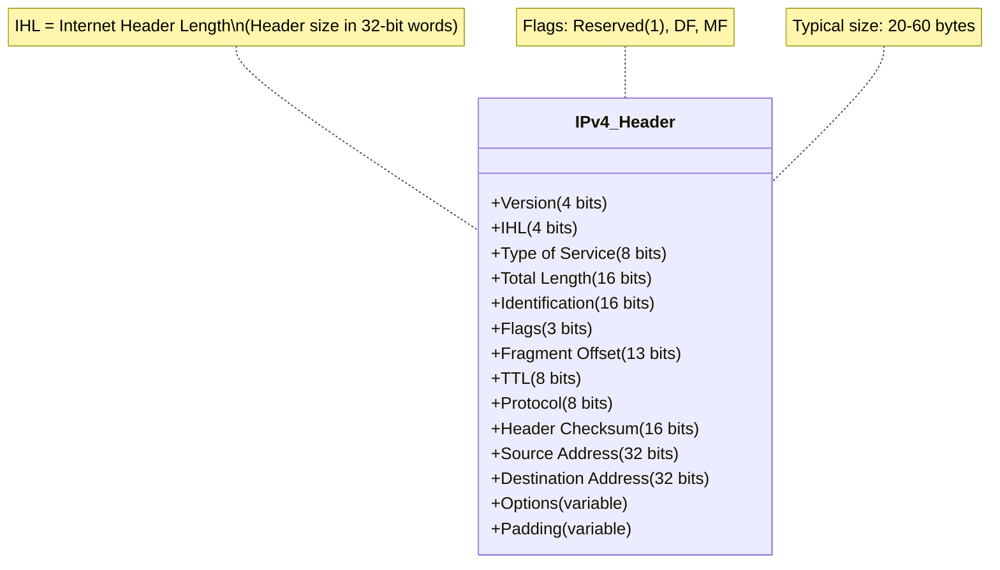
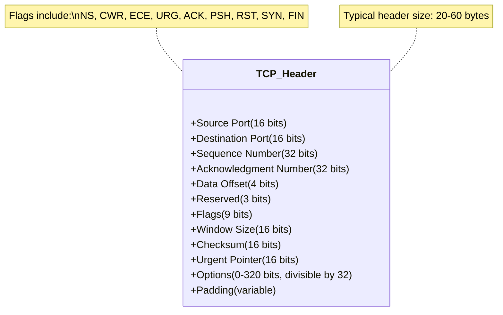

## TCP/IP: Historical and Technical Overview

The Transmission Control Protocol/Internet Protocol (TCP/IP) suite originated from research
funded by the U.S. Department of Defense in the late 1960s and early 1970s, primarily through
the ARPANET project. This project aimed to develop resilient and interoperable networking
technologies.

TCP/IP was first fully specified in RFC 791 (IP) and RFC 793 (TCP) in 1981. It replaced the
older NCP (Network Control Protocol) used in ARPANET. A key milestone was January 1, 1983,
the day known as the flag day, when ARPANET officially transitioned from NCP to TCP/IP.

The design emphasized:
- Interoperability across heterogeneous systems
- Resilience in the face of unreliable networks
- End-to-end principle: Intelligence is mostly at the endpoints, not the network core

### TCP/IP Model vs OSI Model

TCP/IP is a four-layer model, sometimes mapped to the seven-layer OSI model as follows:

|TCP/IP Model       | OSI Model|
|-------------------|--------------------------|
|Application        | Application, Presentation, Session|
|Transport          | Transport|
|Internet           | Network|
|Link               | Data Link, Physical|

#### Layer-by-Layer Technical Breakdown

__1. Link Layer (a.k.a. Network Interface Layer)__
- Lowest layer
- Handles physical addressing, access to physical media (Ethernet, Wi-Fi, etc.)
- Packets here are frames
- Not standardized by TCP/IP itself; relies on existing network technologies

Example protocols:
- Ethernet (IEEE 802.3)
- ARP (Address Resolution Protocol)
- PPP (Point-to-Point Protocol)

__2. Internet Layer__
- Primary protocol: IP (Internet Protocol)
- Responsible for logical addressing, routing, and packet fragmentation

Components:
- IP: Connectionless, best-effort delivery (IPv4 in RFC 791, IPv6 in RFC 8200)
- ICMP: Internet Control Message Protocol (e.g., ping, traceroute)
- IGMP: Internet Group Management Protocol (for multicast)

IP Packet Structure (IPv4)

__3. Transport Layer__

Provides end-to-end communication between applications.

TCP (Transmission Control Protocol)
- Connection-oriented
- Guarantees reliability, ordering, and error checking
- Implements:
- 3-way handshake (SYN, SYN-ACK, ACK)
- Sliding window flow control
- Congestion control (e.g., slow start, AIMD)

TCP Header Fields:

UDP (User Datagram Protocol)
- Connectionless, minimal overhead
- No delivery guarantees
- Often used in:
- Real-time applications (VoIP, games)
- DNS, DHCP

__4. Application Layer__
- High-level protocols for networked applications
- Not concerned with how data is transported

Examples:
- HTTP (Web)
- FTP (File Transfer)
- SMTP/IMAP/POP3 (Email)
- DNS (Name Resolution)
- SSH (Remote Shell)

Each application protocol typically uses a well-known port number:
- HTTP → Port 80
- HTTPS → Port 443
- DNS → Port 53
- SSH → Port 22

__Additional Notes__
- Endianness: TCP/IP protocols generally use big-endian (network byte order)
- Port numbers: 16-bit values; categorized as:
- Well-known (0–1023)
- Registered (1024–49151)
- Dynamic/private (49152–65535)
- Encapsulation: Each layer adds a header, forming a protocol stack.

### Summary

TCP/IP is the foundation of modern computer networking. It abstracts away the underlying hardware and
provides a robust, flexible protocol suite for communication between heterogeneous systems. Despite being
designed in the 1970s, its layered architecture and guiding principles have allowed it to scale and adapt
to today’s massive global internet.

