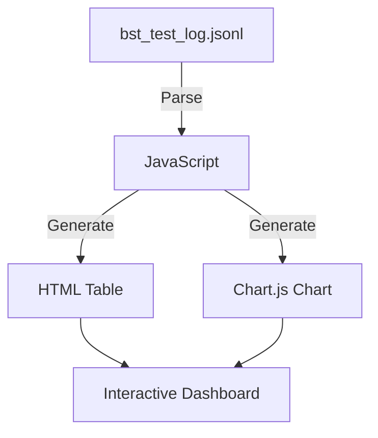
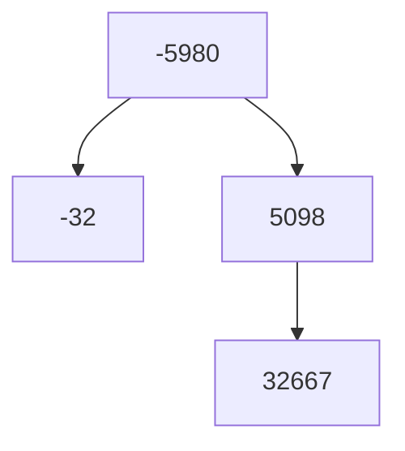
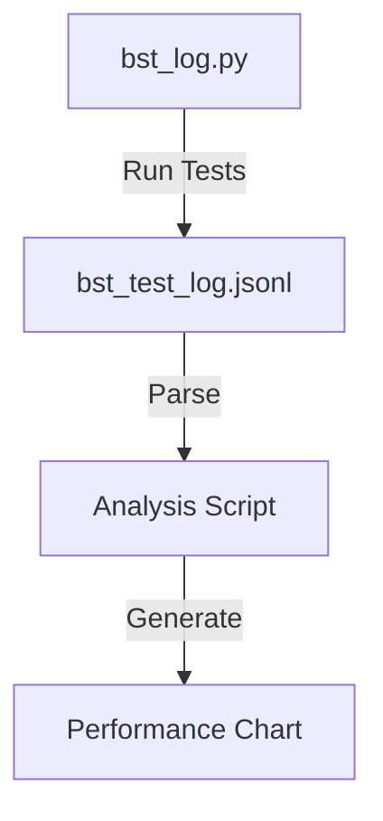
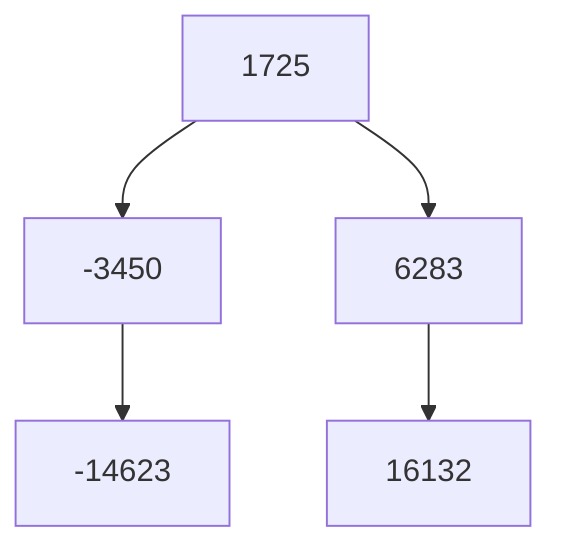
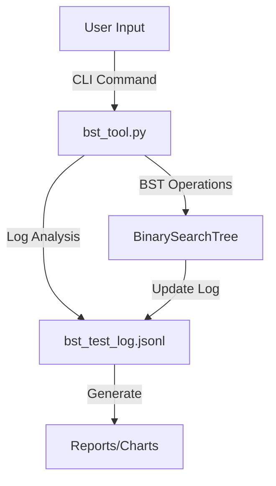
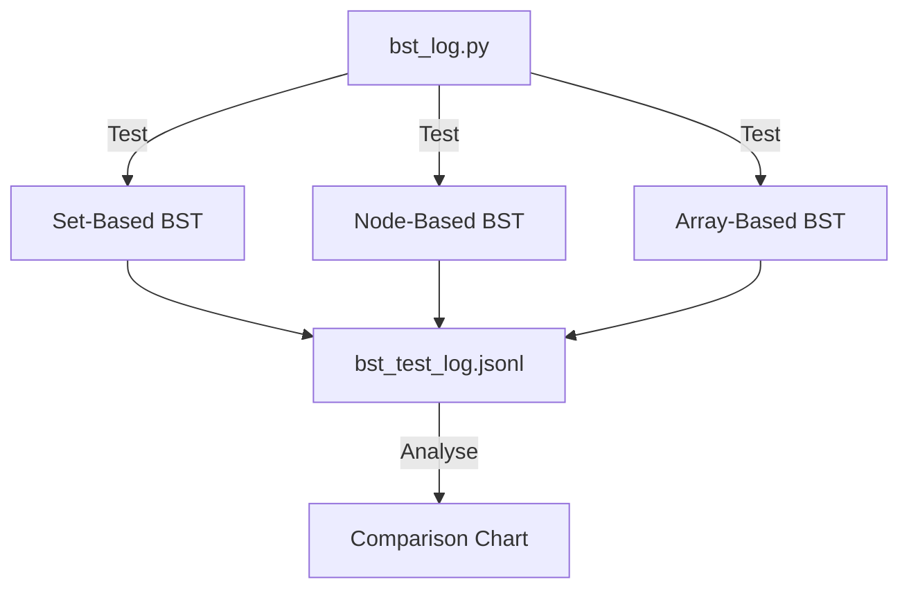
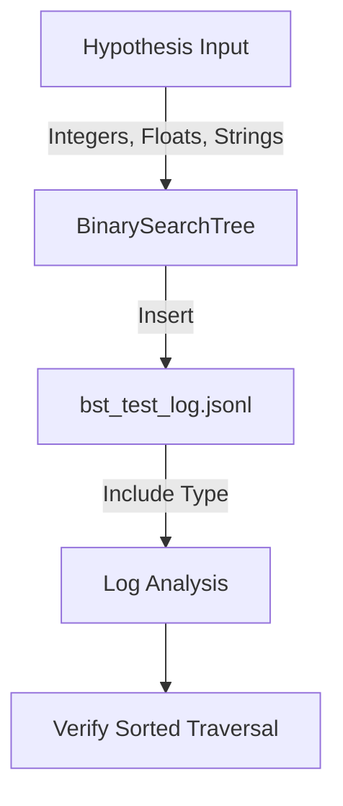

## Project Ideas for Extending Binary Search Tree (BST) Implementation

Below are several project ideas to extend or enhance the provided Binary
Search Tree (BST) codebase. Each project builds on the  files, offering
opportunities to improve functionality, visualisation, or performance.
The projects range from beginner to advanced, and each includes a description,
objectives, relation to the files, steps, and relevant visualisations.


### Project 1: Visualise BST Test Results in the HTML Dashboard

*Description*: Enhance the `bst_log.html` file to create an interactive
dashboard that visualises test results from `bst_test_log.jsonl`. Display
statistics like the number of test cases, average list size, or value
distribution, and include charts for better insights.

*Objectives*:
- Parse `bst_test_log.jsonl` to extract test data (e.g., `generated_values` and `states`).
- Create a dynamic HTML page with JavaScript to show:
  - A table summarising test cases (e.g., number of values, inserted values, final traversal).
  - A chart showing list size or value range distribution.
- Add interactivity (e.g., filter by size or sort by metrics).
- Use chart.html (Chart.js) for visualisations.

*Relation to Files*:
- `bst_test_log.jsonl`: Provides raw test data.
- `bst_log.html`: Starting point for the dashboard (currently minimal).
- `bst.py`: Reuse `is_sorted_ascending` to verify traversals in the dashboard.

*Steps*:
1. Read and parse the JSONL file using JavaScript (`fetch` API).
2. Create a table to display test case details (e.g., number of values, min/max values).
3. Generate a chart (e.g., histogram of list sizes) using chart.html (Chart.js).

*Example Chart*:
Visualise the number of values in each test case:

Open *chart.html*, and upload 'test-case.json'.

*Data Flow Diagram*:


*Skills Gained*:
- JavaScript for data parsing and DOM manipulation.
- Data visualisation with chart.html (Chart.js).
- Working with JSONL files and front-end development.


### Project 2: Implement a Proper BST with Node-Based Structure

*Description*: The current `BinarySearchTree` uses a set, which simplifies
the implementation but isn’t a true BST. Rewrite it to use a node-based
structure with left and right child pointers, and update the test suite
to verify BST properties.

*Objectives*:
- Implement a `Node` class with `value`, `left`, and `right` attributes.
- Rewrite `BinarySearchTree` to use nodes.
- Update `insert`, `inorder_traversal`, `contains`, and `size` for node-based structure.
- Modify `bst_log.py` and `bst_log_pytest.py` to log tree structure
  (e.g., parent-child relationships).
- Ensure tests in `bst.py` pass with the new implementation.

*Relation to Files*:
- `bst.py`: Modify the BST implementation and test suite.
- `bst_log.py`, `bst_log_pytest.py`: Update to log node-based traversals.
- `bst_test_log.jsonl`: Store structural data (e.g., tree height).

*Steps*:
1. Create a `Node` class and update `BinarySearchTree` to use a root node.
2. Implement recursive `insert` and `inorder_traversal`.
3. Log tree structure (e.g., parent-child pairs) in `bst_log.py`.
4. Run Hypothesis tests to verify the implementation.

*Example BST Structure* (Mermaid, for a small test case from `bst_test_log.jsonl`,
e.g., values `[-5980, -32, 5098, 32667]`):


*Skills Gained*:
- Understanding BST data structures and algorithms.
- Recursive programming.
- Adapting test suites for structural changes.


### Project 3: Analyse BST Performance with Large Inputs

*Description*: Extend the test suite to analyse BST performance for different input
sizes and value ranges. Use `bst_test_log.jsonl` to measure metrics like insertion
or traversal time, and visualise results.

*Objectives*:
- Modify `bst_log.py` to record execution times for `insert` and `inorder_traversal`.
- Analyse `bst_test_log.jsonl` for average insertion or traversal times.
- Create a script to generate a chart of performance across test cases.
- Adjust Hypothesis’s `max_size` in `bst.py` for larger inputs.

*Relation to Files*:
- `bst_log.py`, `bst_log_pytest.py`: Add timing data to logs.
- `bst_test_log.jsonl`: Store timing metrics.
- `bst.py`: Tweak Hypothesis settings for larger inputs.

*Steps*:
1. Use Python’s `time` module to measure execution times in `bst_log.py`.
2. Update `bst_test_log.jsonl` to include `insert_time` and `traversal_time`.
3. Parse the log to compute average times per input size.
4. Generate a line chart for performance trends.

Open *chart.html*, and upload 'example-chart.json'.


*Performance Analysis Flow*:


*Skills Gained*:
- Performance benchmarking.
- Data analysis with Python.
- Visualisation of performance metrics.


### Project 4: Add Deletion and Balancing to the BST

*Description*: Extend `BinarySearchTree` to support deletion and self-balancing
(e.g., AVL or Red-Black tree). Update tests to verify these features and log
results in `bst_test_log.jsonl`.

*Objectives*:
- Implement a `delete` method to remove values while maintaining BST properties.
- Add self-balancing (e.g., AVL rotations) for O(log n) performance.
- Update `bst_log.py` to log deletion operations and tree height.
- Extend Hypothesis tests in `bst.py` for deletion scenarios.
- Verify traversals remain sorted after deletions.

*Relation to Files*:
- `bst.py`: Add new methods and tests.
- `bst_log.py`, `bst_log_pytest.py`: Log deletion and balance metrics.
- `bst_test_log.jsonl`: Include deletion and tree height data.

*Steps*:
1. Implement `delete` using standard BST deletion logic.
2. Add AVL balancing (compute balance factors, perform rotations).
3. Log deletion events and tree height in `bst_log.py`.
4. Add Hypothesis tests for deletion and balance.

*AVL Tree After Insertion and Deletion*:


*Skills Gained*:
- Advanced BST operations (deletion, balancing).
- Understanding self-balancing trees.
- Extending test-driven development.


### Project 5: Create a Command-Line BST Testing Tool

*Description*: Build a CLI tool to interact with the BST, run tests, and
analyse logs from `bst_test_log.jsonl`. Support commands for inserting values,
performing traversals, or generating reports.

*Objectives*:
- Create a CLI with `argparse` or `click` for commands like `insert`,
  `traverse`, `contains`, and `analyze`.
- Add an `analyze` command to summarise log data (e.g., number of tests,
  average list size).
- Allow running new test cases and appending to `bst_test_log.jsonl`.
- Integrate with `BinarySearchTree` from `bst.py`.

*Relation to Files*:
- `bst.py`: Provides BST implementation for the CLI.
- `bst_test_log.jsonl`: Data source for analysis.
- `bst_log.py`: Reuse for running new tests.

*Steps*:
1. Create a CLI script with commands for BST operations and analysis.
2. Implement log parsing for reports (e.g., average list size).
3. Allow users to specify inputs or generate random tests with Hypothesis.
4. Save new test results to `bst_test_log.jsonl`.

*ASCII Art for CLI Interface*:
```
+-------------------+
| BST Testing Tool  |
+-------------------+
| Commands:         |
|  insert <values>  |
|  traverse         |
|  contains <value> |
|  analyze <log>    |
+-------------------+
```

*Example CLI Usage*:
```bash
python bst_tool.py insert 5 10 3
python bst_tool.py traverse
python bst_tool.py analyze --log bst_test_log.jsonl
```

*CLI Workflow* (Mermaid):


*Skills Gained*:
- Building CLI applications.
- Parsing and analysing JSONL data.
- Integrating with existing codebases.


### Project 6: Compare BST Implementations

*Description*: Implement alternative BST representations (e.g., array-based
or linked-list-based) and compare their performance against the set-based
implementation in `bst.py`. Use `bst_test_log.jsonl` to log results and
visualise comparisons.

*Objectives*:
- Implement two new BST classes (e.g., array-based, node-based).
- Update `bst_log.py` to test all implementations and log performance.
- Create a script to compare metrics like insertion time or memory usage.
- Generate a chart for performance differences.

*Relation to Files*:
- `bst.py`: Baseline set-based BST.
- `bst_log.py`: Test multiple implementations.
- `bst_test_log.jsonl`: Store performance data.

*Steps*:
1. Create new BST classes with different structures.
2. Modify `bst_log.py` to test all implementations and log results.
3. Parse the log to compute performance metrics.
4. Generate a chart comparing insertion times.

Open *chart.html*, and upload 'example-insert.json'.

*Implementation Comparison Flow* (Mermaid):


*Skills Gained*:
- Comparing data structure implementations.
- Performance analysis and benchmarking.
- Data visualisation.


### Project 7: Add Support for Non-Integer Values

*Description*: Extend the BST to support non-integer values (e.g.,
strings or floats) and update the test suite to handle these types.
Modify logging to capture type information.

*Objectives*:
- Update `BinarySearchTree` in `bst.py` for comparable types.
- Modify Hypothesis tests in `bst_log.py` for mixed-type inputs.
- Update `bst_test_log.jsonl` to include type information.
- Ensure `inorder_traversal` sorts correctly for all types.

*Relation to Files*:
- `bst.py`: Modify to support new types.
- `bst_log.py`, `bst_log_pytest.py`: Use Hypothesis strategies for strings/floats.
- `bst_test_log.jsonl`: Log type metadata.

*Steps*:
1. Update `BinarySearchTree` to use generic comparison operators.
2. Modify Hypothesis to use `st.one_of(st.integers(), st.floats(), st.text())`.
3. Add type information to `bst_test_log.jsonl`.
4. Verify sorted traversals for all types.

*Type Handling Flow* (Mermaid):


*Skills Gained*:
- Handling generic types in Python.
- Extending Hypothesis tests for diverse inputs.
- Ensuring type safety in data structures.

