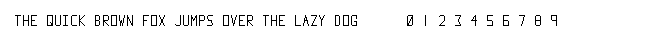
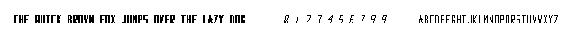

## Vector text

The data dictionary represents a set of vector line segments that define each character or number in a simple, stylized font. Each character is created using a sequence of connected line segments with specified start and end points, relative to a common origin for alignment. These vector paths are used to render each glyph by connecting these defined points on a grid.

An empty white image grid is created, and a line-drawing algorithm (similar to Bresenham’s line algorithm) is used to apply each character’s line segments to the image. Each character is spaced horizontally using a set spacing value. As the algorithm iterates over each character, it “draws” them on the image in the specified positions, creating a visual representation of the text message using only line segments, without relying on any existing fonts or rasterized text data.

Finally, the rendered text is saved as an image file in the PPM format, storing RGB values for each pixel across the image, thereby creating a custom bitmap representation of the vector-based text.

### First test with text

File: `text.py`. Sample with scale = 1. The text is saved as an image in the PPM format (converted here to PNG).

### Add slant

To slant text, we apply a shearing matrix to each (x, y) coordinate.
The shearing transformation matrix to slant by an angle  $\theta$  is:

This matrix shifts each y coordinate by a factor of  $x \times \tan(\theta)$ , where  $\theta$  is the slant angle.

A simple way of doing slanted text, is to use a pre-calculated constant instead of calculating it each time for each glyph or letter.

We also add bold text by drawing the same as with normal text, only one pixel to the right.

File: `text2.py`. Sample scale = 0.75, with styles NORMAL, BOLD, SLANTED, SLANTEDBOLD. Text saved as image in PPM format.

